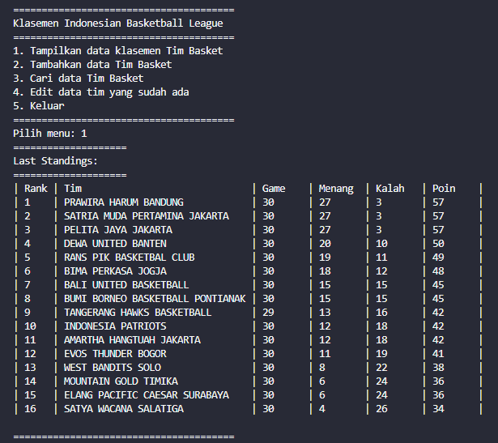
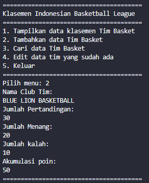
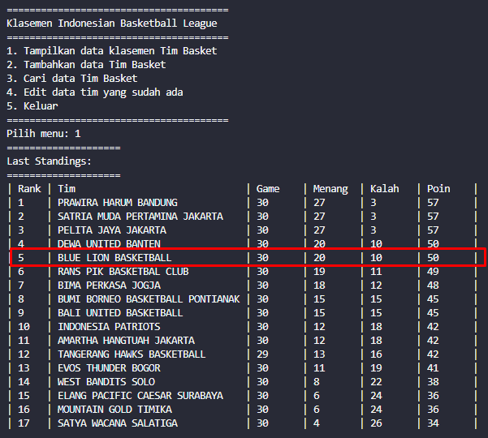
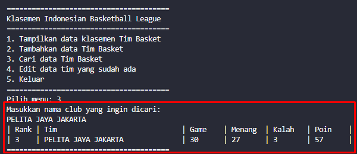
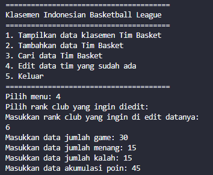
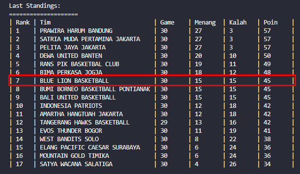

# LAPORAN KUIS 2 ALGORITMA STRUKTUR DATA

Nama    : Cakra Wangsa M.A.W

Kelas   : TI_1H

Absen   : 07

NIM     : 2341720032

##### CLASS PADA KODE PROGRAM

```java
package KUIS2;

public class Node {
    
    Club data;
    Node next;
    
    Node (Club data, Node berikutnya) {
        this.data = data;
        this.next = berikutnya;
        }
    }
```

```java
package KUIS2;

public class Club {
    
    String namaCLub;
    int jmlMatch;
    int jmlMenang;
    int jmlKalah;
    int point;

    Club (String namaCLub, int jmlMatch, int jmlMenang, int jmlKalah, int point) {
        this.namaCLub = namaCLub;
        this.jmlMatch = jmlMatch;
        this.jmlMenang = jmlMenang;
        this.jmlKalah = jmlKalah;
        this.point = point;
    }
}
```

```java
package KUIS2;


import java.util.Scanner;

public class SingleLinkedList {
    Node head, tail;

    boolean isEmpty(){
        if(head == null){
            return true;
        }else{
            return false;
        }
    }
    void print(){
        if (!isEmpty()) {
            Node tmp = head;
            System.out.println("====================");
            System.out.println("Last Standings: ");
            System.out.println("====================");
            System.out.printf("| %-4s | %-32s | %-7s | %-7s | %-7s | %-7s |\n", "Rank", "Tim", "Game", "Menang", "Kalah", "Poin");
            int i = 1;
            while(tmp != null){
                System.out.printf("| %-4s | %-32s | %-7s | %-7s | %-7s | %-7s |\n", i, tmp.data.namaCLub, tmp.data.jmlMatch, tmp.data.jmlMenang, tmp.data.jmlKalah, tmp.data.point);
                tmp = tmp.next;
                i++;
            }
            System.out.println("");
        }else{
            System.out.println("Linked List Kosong");
        }
    }
    
    void addLast (Club input){
        Node ndInput = new Node(input, null);
        if (!isEmpty()) {
            tail.next = ndInput;
            tail = ndInput;
        }else{
            head = ndInput;
            tail = ndInput;
        }
        sort();
    }
    void removeFirst(){
        if (isEmpty()) {
            System.out.println("Linked list masing kosong, tidak dapat dihapus");
        }else if (head == tail) {
            head = tail = null;
            
        }else{
            head = head.next;
        }
    }
    void removeLast(){
        if (isEmpty()) {
            System.out.println("Linked list masih kosong, tidak dapat dihapus");

        }else{
            Node temp = head;
            while(temp.next.next != null){
                temp = temp.next;
            }
            temp.next = null;
            tail = temp.next;
        }
    }

    public void search(String namaClub){
        Node temp = head;
        int i = 1;
        while(temp != null){
            if (temp.data.namaCLub.equalsIgnoreCase(namaClub)) {
                System.out.printf("| %-4s | %-32s | %-7s | %-7s | %-7s | %-7s |\n", "Rank", "Tim", "Game", "Menang", "Kalah", "Poin");
                System.out.printf("| %-4s | %-32s | %-7s | %-7s | %-7s | %-7s |\n", i, temp.data.namaCLub, temp.data.jmlMatch, temp.data.jmlMenang, temp.data.jmlKalah, temp.data.point);
                break;
            }
            temp = temp.next;
            i++;
        }
    }
    public void sort(){
        Node temp = head;
        while (temp != null) {
            Node temp2 = temp.next;
            while (temp2 != null) {
                if (temp.data.point < temp2.data.point) {
                    Club temp3 = temp.data;
                    temp.data = temp2.data;
                    temp2.data = temp3;
                }
                temp2 = temp2.next;
            }
            temp = temp.next;
        }
    }
    public void edit(){
        System.out.println("Masukkan rank club yang ingin di edit datanya: ");
        Scanner sc = new Scanner(System.in);
        int rank = sc.nextInt();
        
        Node temp = head;
        int i=1;
        while (temp !=null) {
            if (rank==1 && temp == head) {
                System.out.print("Masukkan data jumlah game: ");
                temp.data.jmlMatch = sc.nextInt();
                System.out.print("Masukkan data jumlah menang: ");
                temp.data.jmlMenang = sc.nextInt();
                System.out.print("Masukkan data jumlah kalah: ");
                temp.data.jmlKalah = sc.nextInt();
                System.out.print("Masukkan data akumulasi poin: ");
                temp.data.point = sc.nextInt();
                break;
            }else if (i+1==rank) {
                System.out.print("Masukkan data jumlah game: ");
                temp.data.jmlMatch = sc.nextInt();
                System.out.print("Masukkan data jumlah menang: ");
                temp.data.jmlMenang = sc.nextInt();
                System.out.print("Masukkan data jumlah kalah: ");
                temp.data.jmlKalah = sc.nextInt();
                System.out.print("Masukkan data akumulasi poin: ");
                temp.data.point = sc.nextInt();
                break;
            }
            temp = temp.next;
            i++;
            
        }
        sort();
        
    }
    
    
}
```

##### MAIN PADA KODE PROGRAM

```java
package KUIS2;

import java.util.Scanner;

public class MainBasket {

    public static void main(String[] args) {
        Scanner sc = new Scanner(System.in);
        SingleLinkedList sll = new SingleLinkedList();

        // DATA KLASEMEN IBL 2023
        sll.addLast(new Club("PRAWIRA HARUM BANDUNG", 30, 27, 3, 57));
        sll.addLast(new Club("SATRIA MUDA PERTAMINA JAKARTA",30, 27, 3, 57));
        sll.addLast(new Club("PELITA JAYA JAKARTA",30,27,3,57));
        sll.addLast(new Club("DEWA UNITED BANTEN", 30, 20, 10, 50));
        sll.addLast(new Club("RANS PIK BASKETBAL CLUB",30, 19, 11, 49));
        sll.addLast(new Club("BIMA PERKASA JOGJA", 30, 18, 12, 48));
        sll.addLast(new Club("BALI UNITED BASKETBALL", 30, 15, 15, 45));
        sll.addLast(new Club("BUMI BORNEO BASKETBALL PONTIANAK", 30, 15, 15, 45));
        sll.addLast(new Club("TANGERANG HAWKS BASKETBALL", 29, 13, 16, 42));
        sll.addLast(new Club("INDONESIA PATRIOTS",30, 12, 18, 42));
        sll.addLast(new Club("AMARTHA HANGTUAH JAKARTA",30, 12, 18, 42));
        sll.addLast(new Club("EVOS THUNDER BOGOR", 30, 11, 19, 41));
        sll.addLast(new Club("WEST BANDITS SOLO", 30, 8, 22, 38));
        sll.addLast(new Club("MOUNTAIN GOLD TIMIKA",30, 6, 24, 36));
        sll.addLast(new Club("ELANG PACIFIC CAESAR SURABAYA",30, 6, 24, 36));
        sll.addLast(new Club("SATYA WACANA SALATIGA",30, 4, 26, 34));

        while (true) {
            System.out.println("=======================================");
            System.out.println("Klasemen Indonesian Basketball League");
            System.out.println("=======================================");
            System.out.println("1. Tampilkan data klasemen Tim Basket");
            System.out.println("2. Tambahkan data Tim Basket"); 
            System.out.println("3. Cari data Tim Basket");
            System.out.println("4. Edit data tim yang sudah ada");
            System.out.println("5. Keluar");
            System.out.println("=======================================");
            System.out.print("Pilih menu: ");
            int pilih = sc.nextInt();
            sc.nextLine();
            switch (pilih) {

                case 1:
                    sll.print();
                    break;

                case 2:
                    System.out.println("Nama Club Tim:");
                    String name = sc.nextLine();
                    System.out.println("Jumlah Pertandingan: ");
                    int match = sc.nextInt();
                    System.out.println("Jumlah Menang: ");
                    int win = sc.nextInt();
                    System.out.println("Jumlah kalah: ");
                    int lose = sc.nextInt();
                    System.out.println("Akumulasi poin: ");
                    int point = sc.nextInt();
                    Club club = new Club(name, match, win, lose, point);
                    sll.addLast(club);
                    break;

                case 3:
                    System.out.println("Masukkan nama club yang ingin dicari: ");
                    String clubName = sc.nextLine();
                    sll.search(clubName);
                    break;
                
                case 4:
                    System.out.println("Pilih rank club yang ingin diedit: ");
                    sll.edit();
                    break;
                
                case 5:
                    System.exit(0);
                    break;
            
                default:
                    System.out.println("Pilihan tidak tersedia");
                    break;
            }
            
        }
    }
}
```

##### OUTPUT PADA KODE PROGRAM

Pada output pertama ini menunjukan Klasemen yang ada pada Indonesian Basketball League 



Pada output kedua ini menunjukkan untuk menambahkan tim basket pada Indonesia Basketball League



Pada output ketiga ini menunjukkan data tim yang baru ditambahkan pada Indonesia Basketball League



Pada output keempat ini menunjukkan nama tim basket ataupun club yang ingin dicari dengan menggunakan nama pada tim basket yang ada pada Indonesia Basketball League



Pada output kelima ini menunjukkan pada proses pengeditan mengenai data yang salah input dan sebagainya



dan Pada output terakhir yaitu output keenam ini menunjukkan klasemen pada data yang sudah dilakukkan pembenahan

