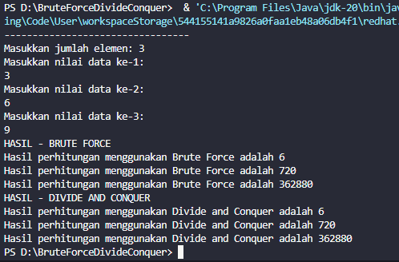
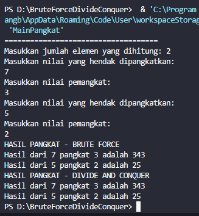
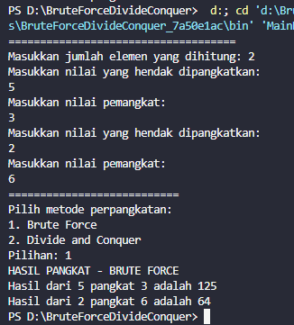
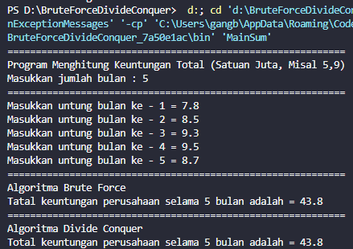
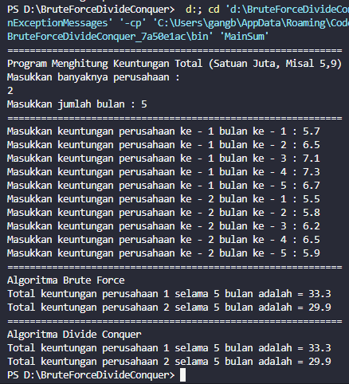

# LAPORAN PRAKTIKUM 5 
## ALGORITMA DAN STRUKTUR DATA

Nama : Cakra Wangsa M.A.W

Kelas : TI-1H

Absen : 07

NIM : 2341720032

### 4.2.1 Langkah-langkah Percobaan

Input kode pada class

``` java
public class Faktorial {
    public int nilai;

    int faktorialBF(int n) {
        int fakto = 1;
        for (int i = 1; i <= n; i++) {
            fakto = fakto * i;
        }
        return fakto;
    }

    int faktorialDC(int n) {
        if (n == 1) {
            return 1;
        } else {
            int fakto = n * faktorialDC(n - 1);
            return fakto;
        }
    }
}
``` 

Input kode pada Main

``` java
import java.util.Scanner;

public class MainFaktorial {
    public static void main(String[] args) {
        Scanner sc = new Scanner(System.in);

        System.out.println("---------------------------------");
        System.out.print("Masukkan jumlah elemen: ");
        int iJml = sc.nextInt();

        Faktorial[] fk = new Faktorial[iJml];
            for (int i = 0; i < iJml; i++) {
            fk[i] = new Faktorial();
            System.out.println("Masukkan nilai data ke-" + (i + 1) + ":");
            fk[i].nilai = sc.nextInt();
        }

        System.out.println("HASIL - BRUTE FORCE");
        for (int i = 0; i < iJml; i++) {
            System.out
                    .println("Hasil perhitungan menggunakan Brute Force adalah " + fk[i].faktorialBF(fk[i].nilai));
        }

        System.out.println("HASIL - DIVIDE AND CONQUER");
        for (int i = 0; i < iJml; i++) {
            System.out.println(
                    "Hasil perhitungan menggunakan Divide and Conquer adalah " + fk[i].faktorialDC(fk[i].nilai));
        }
    }
}
```

### 4.2.2 Verifikasi Hasil Percobaan

Output pada kode program



### 4.2.3 Pertanyaan

1. Pada base line Algoritma Divide Conquer untuk melakukan pencarian nilai faktorial, jelaskan

    Jawab:

    blok program if akan dipakai untuk memeriksa apakah nilai n sama dengan 1. Sedangkan blok program else digunakan untuk memeriksa apakah nilai n tidak sama dengan 1. Blok if: Mengembalikan nilai 1 (basis rekursi) jika n sama dengan 1. Sedangkan blok else: Menghitung nilai faktorial dengan mengalikan n dengan hasil rekursi dari faktorialDC(n - 1).
    perbedaan bagian kode pada penggunaan if dan else!

2. Apakah memungkinkan perulangan pada method faktorialBF() dirubah selain menggunakan
for?Buktikan!

    Jawab:

    bisa, dengan cara ganti perulangan for menjadi perulangan lain seperti while
   
    ``` java

    public class Faktorial {
        public int nilai;

        int faktorialBF(int n) {
            int fakto = 1;
            int i = 1;
            while (i <= n) {
                fakto = fakto * i;
                i++;
            }
            return fakto;
        }

        int faktorialDC(int n) {
            if (n == 1) {
                return 1;
            } else {
                int fakto = n * faktorialDC(n - 1);
                return fakto;
            }
        }
    }
    ```


3. Jelaskan perbedaan antara fakto *= i; dan int fakto = n * faktorialDC(n-1); !

Jawab: 

 fakto * = i; merupakan singkatan dari faktor = fakto * i; yang berarti nilai 'fakto' akan dikali dengan 'i' pada setiap iterasi looping. Sedangkan **fakto = n*faktorialDC(n-1);** merupakan operasi rekursif untuk menghhitung nilai faktorial. Operasi akan menghitung dengan mengkalikan 'n' dengan nilai faktorial 'n-1' yang terus berlanjut hingga mencapai base case.

### 4.3 Menghitung Hasil Pangkat dengan Algoritma Brute Force dan Divide and Conquer

### 4.3.1 Langkah-langkah Percobaan

Class pada kode program

```java
public class Pangkat {
    
    public int nilai, pangkat;

    int pangkatBF(int a, int n) {
        int hasil = 1;
        for (int i = 0; i < n; i++) {
            hasil *= a;
        }
        return hasil;
    }

    int pangkatDC(int a, int n) {
        if (n == 0) {
            return 1;
        } else {
            if (n % 2 == 1) {
                return (pangkatDC(a, n / 2) * pangkatDC(a, n / 2) * a);
            } else {
                return (pangkatDC(a, n / 2) * pangkatDC(a, n / 2));
            }
        }
    }
}
```

Main pada kode program

``` java
import java.util.Scanner;

public class MainPangkat {
     public static void main(String[] args) {
        Scanner sc = new Scanner(System.in);

        System.out.println("====================================");
        System.out.print("Masukkan jumlah elemen yang dihitung: ");
        int elemen = sc.nextInt();

        Pangkat [] png = new Pangkat[elemen];
        for (int i = 0; i < elemen; i++) {
            png[i] = new Pangkat();
            System.out.println("Masukkan nilai yang hendak dipangkatkan: ");
            png[i].nilai = sc.nextInt();
            System.out.println("Masukkan nilai pemangkat: ");
            png[i].pangkat = sc.nextInt();
        }

        System.out.println("HASIL PANGKAT - BRUTE FORCE");
        for (int i = 0; i < elemen; i++) {
            System.out.println("Hasil dari " + png[i].nilai + " pangkat " + png[i].pangkat + " adalah "
                    + png[i].pangkatBF(png[i].nilai, png[i].pangkat));
        }

        System.out.println("HASIL PANGKAT - DIVIDE AND CONQUER");
        for (int i = 0; i < elemen; i++) {
            System.out.println("Hasil dari " + png[i].nilai + " pangkat " + png[i].pangkat + " adalah "
                    + png[i].pangkatDC(png[i].nilai, png[i].pangkat));
        }
    }
}
```

Output pada kode program



### 4.3.3 Pertanyaan

1. Jelaskan mengenai perbedaan 2 method yang dibuat yaitu PangkatBF() dan PangkatDC()!

    Jawab:
    pangkatBF() digunakan pada pendekatan iteratif loop 'for' dengan melakukan perkalian sebanyak 'n' kali secara langsung. Sedangkan pangkatDC() digunakan pada pendekatan rekursif, dengan membagi masalah perpangkatan menjadi sub-masalah yang lebih kecil dan melakukan combine hasil akhir.

2. Apakah tahap combine sudah termasuk dalam kode tersebut?Tunjukkan!

    Jawab:
    Ya, tahap combine terjadi ketika hasil dari dua penggunaan rekursif pangkatDC(a, n/2) dikalikan. Jika n adalah bilangan ganjil maka hasil tersebut juka dikalikan dengan a.

    contoh kode program
    ``` java
     if (n % 2 == 1) {
    return (pangkatDC(a, n / 2) * pangkatDC(a, n / 2) * a);
    } else {
    return (pangkatDC(a, n / 2) * pangkatDC(a, n / 2));
    }
    ```

3. Modifikasi kode program tersebut, anggap proses pengisian atribut dilakukan dengan konstruktor.

Class pada kode program

    Jawab:

    ``` java
    public class Pangkat {
    
    public int nilai, pangkat;

    public Pangkat(int nilai, int pangkat) {
        this.nilai = nilai;
        this.pangkat = pangkat;
    }

    int pangkatBF(int a, int n) {
        int hasil = 1;
        for (int i = 0; i < n; i++) {
            hasil *= a;
        }
        return hasil;
    }

    int pangkatDC(int a, int n) {
        if (n == 0) {
            return 1;
        } else {
            if (n % 2 == 1) {
                return (pangkatDC(a, n / 2) * pangkatDC(a, n / 2) * a);
            } else {
                return (pangkatDC(a, n / 2) * pangkatDC(a, n / 2));
            }
        }
    }
}
```

Main pada kode program

``` java
import java.util.Scanner;

public class MainPangkat {
    public static void main(String[] args) {
        Scanner sc = new Scanner(System.in);

        System.out.println("====================================");
        System.out.print("Masukkan jumlah elemen yang dihitung: ");
        int elemen = sc.nextInt();

        Pangkat[] png = new Pangkat[elemen];
        for (int i = 0; i < elemen; i++) {
            System.out.println("Masukkan nilai yang hendak dipangkatkan: ");
            int nilai = sc.nextInt();
            System.out.println("Masukkan nilai pemangkat: ");
            int pangkat = sc.nextInt();
            png[i] = new Pangkat(nilai, pangkat);
        }

        System.out.println("HASIL PANGKAT - BRUTE FORCE");
        for (int i = 0; i < elemen; i++) {
            System.out.println("Hasil dari " + png[i].nilai + " pangkat " + png[i].pangkat + " adalah "
                    + png[i].pangkatBF(png[i].nilai, png[i].pangkat));
        }

        System.out.println("HASIL PANGKAT - DIVIDE AND CONQUER");
        for (int i = 0; i < elemen; i++) {
            System.out.println("Hasil dari " + png[i].nilai + " pangkat " + png[i].pangkat + " adalah "
                    + png[i].pangkatDC(png[i].nilai, png[i].pangkat));
        }
    }
}
```


4. Tambahkan menu agar salah satu method yang terpilih saja yang akan dijalankan menggunakan switch-case!

    Jawab:

    ``` java
    import java.util.Scanner;

    public class MainPangkat {
        public static void main(String[] args) {
            Scanner sc = new Scanner(System.in);

            System.out.println("====================================");
            System.out.print("Masukkan jumlah elemen yang dihitung: ");
            int elemen = sc.nextInt();

            Pangkat[] png = new Pangkat[elemen];
            for (int i = 0; i < elemen; i++) {
                System.out.println("Masukkan nilai yang hendak dipangkatkan: ");
                int nilai = sc.nextInt();
                System.out.println("Masukkan nilai pemangkat: ");
                int pangkat = sc.nextInt();
                png[i] = new Pangkat(nilai, pangkat);
            }
            
            System.out.println("===========================");
            System.out.println("Pilih metode perpangkatan: ");
            System.out.println("1. Brute Force");
            System.out.println("2. Divide and Conquer");
            System.out.print("Pilihan: ");
            int pilihan = sc.nextInt();

            switch (pilihan) {
                case 1:
                    System.out.println("HASIL PANGKAT - BRUTE FORCE");
                    for (int i = 0; i < elemen; i++) {
                        System.out.println("Hasil dari " + png[i].nilai + " pangkat " + png[i].pangkat + " adalah "
                                + png[i].pangkatBF(png[i].nilai, png[i].pangkat));
                    }
                    break;
                case 2:
                    System.out.println("HASIL PANGKAT - DIVIDE AND CONQUER");
                    for (int i = 0; i < elemen; i++) {
                        System.out.println("Hasil dari " + png[i].nilai + " pangkat " + png[i].pangkat + " adalah "
                                + png[i].pangkatDC(png[i].nilai, png[i].pangkat));
                    }
                    break;
                default:
                    System.out.println("Pilihan tidak tersedia");
                    break;
            }
        }
    }
    ```

    Output pada kode program

    


### 4.4 Menghitung Sum Array dengan Algoritma Brute Force dan Divide and Conquer

### 4.4.1 Langkah-langkah Percobaan

Class pada kode program

``` java
public class Sum {
    int elemen;
    double keuntungan[], total;

    Sum(int elemen) {
        this.elemen = elemen;
        this.keuntungan = new double[elemen];
        this.total = 0;
    }

    double totalBF(double arr[]) {
        for (int i = 0; i < elemen; i++) {
            total = total + arr[i];
        }
        return total;
    }

    double totalDC(double arr[], int l, int r) {
        if (l == r) {
            return arr[l];
        } else if (l < r) {
            int mid = (l + r) / 2;
            double lsum = totalDC(arr, l, mid);
            double rsum = totalDC(arr, mid + 1, r);
            return lsum + rsum;
        }
        return 0;
    }
}
```

Main pada kode program

``` java
import java.util.Scanner;

public class MainSum {
    public static void main(String[] args) {
        Scanner sc = new Scanner(System.in);
        System.out.println("============================================================");
        System.out.println("Program Menghitung Keuntungan Total (Satuan Juta, Misal 5.9)");
        System.out.print("Masukkan jumlah bulan : ");
        int elm = sc.nextInt();

        Sum sm = new Sum(elm);
        System.out.println("============================================================");
        for (int i = 0; i < sm.elemen; i++) {
            System.out.print("Masukkan untung bulan ke - " + (i + 1) + " = ");
            sm.keuntungan[i] = sc.nextDouble();
        }

        System.out.println("============================================================");
        System.out.println("Algoritma Brute Force");
        System.out.println(
                "Tatal keuntungan perusahaan selama " + sm.elemen + " bulan adalah = " + sm.totalBF(sm.keuntungan));
        System.out.println("============================================================");
        System.out.println("Algoritma Divide Conquer");
        System.out.println("Total keuntungan perusahaan selama " + sm.elemen + " bulan adalah = "
                + sm.totalDC(sm.keuntungan, 0, sm.elemen - 1));
    }
}
```

Output pada kode program




### 4.4.3 Pertanyaan

1. Mengapa terdapat formulasi return value berikut?Jelaskan!

    Jawab:

    ```java
    return lsum + rsum + arr[mid];
    ```

    karena pada baris tersebut digunakan untuk menambah total pada semua nilai dari 'lsum' dimana merupakan total dari sub-array disebelah kiri, 'rsum' adalah total dari sub-array di sebelah kanan, dan 'arr[mid]' adalah elemen tengah dari array.

2. Kenapa dibutuhkan variable mid pada method TotalDC()?

    Jawab:

     Variabel 'mid' digunakan untuk membagi sub-array menjadi 2 bagian yang sama besar yaitu: 'lsum' untuk kiri dan 'rsum' untuk kanan.

3. Program perhitungan keuntungan suatu perusahaan ini hanya untuk satu perusahaan saja.Bagaimana cara menghitung sekaligus keuntungan beberapa bulan untuk beberapa
perusahaan.(Setiap perusahaan bisa saja memiliki jumlah bulan berbeda-beda)? Buktikan
dengan program!

    Jawab:

    Class pada kode program

    ``` java
    public class Sum {
        int elemen;
        double keuntungan[][], total[];

        Sum(int perusahaan, int bulan) {
            this.elemen = bulan;
            this.keuntungan = new double[perusahaan][bulan];
            this.total = new double[perusahaan];
        }

        double totalBF(double arr[], int noPerusahaan) {
            for (int i = 0; i < elemen; i++) {
                total[noPerusahaan] = total[noPerusahaan] + arr[i];
            }
            return total[noPerusahaan];
        }

        double totalDC(double arr[], int l, int r) {
            if (l == r) {
                return arr[l];
            } else if (l < r) {
                int mid = (l + r) / 2;
                double lsum = totalDC(arr, l, mid);
                double rsum = totalDC(arr, mid + 1, r);
                return lsum + rsum;
            }
            return 0;
        }
    }
    ```

    Main pada kode program

    ``` java
    import java.util.Scanner;

    public class MainSum {
        public static void main(String[] args) {
            Scanner sc = new Scanner(System.in);
            System.out.println("============================================================");
            System.out.println("Program Menghitung Keuntungan Total (Satuan Juta, Misal 5,9)");
            System.out.println("Masukkan banyaknya perusahaan : ");
            int perusahaan = sc.nextInt();
            System.out.print("Masukkan jumlah bulan : ");
            int bulan = sc.nextInt();

            Sum sm = new Sum(perusahaan, bulan);
            System.out.println("============================================================");
            for (int i = 0; i < perusahaan; i++) {
                for (int j = 0; j < sm.elemen; j++) {
                    System.out.print("Masukkan keuntungan perusahaan ke - " + (i + 1) + " bulan ke - " + (j + 1) + " : ");
                    sm.keuntungan[i][j] = sc.nextDouble();
                }
            }

            System.out.println("============================================================");
            System.out.println("Algoritma Brute Force");
            for (int k = 0; k < perusahaan; k++) {
                System.out.println(
                        "Total keuntungan perusahaan " + (k + 1) + " selama " + sm.elemen + " bulan adalah = "
                                + sm.totalBF(sm.keuntungan[k], k));
            }

            System.out.println("============================================================");
            System.out.println("Algoritma Divide Conquer");
            for (int i = 0; i < perusahaan; i++) {
                System.out.println("Total keuntungan perusahaan " + (i + 1) + " selama " + sm.elemen + " bulan adalah = "
                        + sm.totalDC(sm.keuntungan[i], 0, sm.elemen - 1));
            }
        }
    }
    ```

Output pada kode program




