## LAPORAN PRAKTIKUM

## JOBSHEET - 6
### SORTING (BUBBLE, SELECTION, DAN INSERTION SORT)

Nama    : Cakra Wangsa M.A.W

Kelas   : TI_1H

Absen   : 07

NIM     : 2341720032

### 5.1 Tujuan Praktikum
Setelah melakukan praktikum ini diharapkan mahasiswa mampu:
a. Mahasiswa mampu membuat algoritma searching bubble sort, selection sort dan insertion sort

b. Mahasiswa mampu menerapkan algoritma searching bubble sort, selection sort dan insertion sort pada program.


### 5.2 Mengurutkan Data Mahasiswa Berdasarkan IPK Menggunakan Bubble Sort

### 5.2.1 Langkah-langkah Percobaan

Class pada kode program

```java


public class mahasiswa {
    String nama;
    int thnMasuk, umur;
    double IPK;

    mahasiswa(String n, int t, int u, double i) {
        nama = n;
        thnMasuk = t;
        umur = u;
        IPK = i;
    }

    void tampil() {
        System.out.println("Nama: " + nama);
        System.out.println("Tahun Masuk: " + thnMasuk);
        System.out.println("Umur: " + umur);
        System.out.println("IPK: " + IPK);
    }
}
```
```java


public class DaftarMahasiswaBerprestasi07 {
    mahasiswa[] listMhs = new mahasiswa[5];
    int idx;

    void tambah(mahasiswa m) {
        if (idx < listMhs.length) {
            listMhs[idx] = m;
            idx++;
        } else {
            System.out.println("Data sudah penuh");
        }
    }

    void tampil() {
        for (mahasiswa m : listMhs) {
            m.tampil();
            System.out.println("------------------------------");
        }
    }

    void bubbleSort() {
        for (int i = 0; i < listMhs.length - 1; i++) {
            for (int j = 1; j < listMhs.length - i; j++) {
                if (listMhs[j].IPK > listMhs[j - 1].IPK) { // descending
                    mahasiswa temp = listMhs[j];
                    listMhs[j] = listMhs[j - 1];
                    listMhs[j - 1] = temp;
                }
            }
        }
    }
}

```

Main pada kode program

``` java
public class main07 {
    public static void main(String[] args) {
        DaftarMahasiswaBerprestasi07 list = new DaftarMahasiswaBerprestasi07();
        mahasiswa m1 = new mahasiswa("Nusa", 2017, 25, 3);
        mahasiswa m2 = new mahasiswa("Rara", 2012, 19, 4);
        mahasiswa m3 = new mahasiswa("Dompu", 2018, 19, 3.5);
        mahasiswa m4 = new mahasiswa("Abdul", 2017, 23, 2);
        mahasiswa m5 = new mahasiswa("Ummi", 2019, 21, 3.75);

        list.tambah(m1);
        list.tambah(m2);
        list.tambah(m3);
        list.tambah(m4);
        list.tambah(m5);

        System.out.println("Data mahasiswa sebelum sorting = ");
        list.tampil();

        System.out.println("Data mahasiswa setelah sorting desc berdasarkan IPK");
        list.bubbleSort();
        list.tampil();
    }
}
```


### 5.2.2 Verifikasi Hasil Percobaan

Output pada kode program

Sebelum

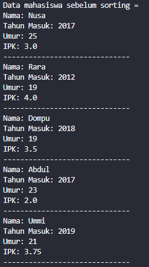

Sesudah

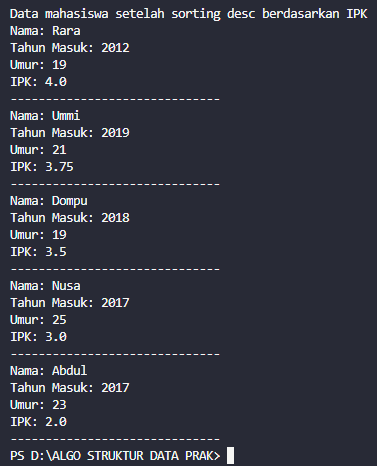


### 5.2.3 Pertanyaan

1. Terdapat di method apakah proses bubble sort?

    Jawab:

    pada proses bubble sort terdapat pada method 'bubbleSort' yang berada di class DaftarMahasiswaBerprestasi07

2. Di dalam method bubbleSort(), terdapat baris program seperti di bawah ini:
    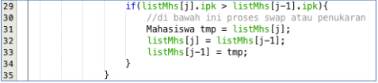
    Untuk apakah proses tersebut?

    Jawab:

    Proses tersebut digunakan sebagai tukar posisi kedua elemen pada array listMhs. dengan Penukaran posisi yang dilakukan berdasarkan nilai IPK dari kedua elemen yang dibandingkan.

3. Perhatikan perulangan di dalam bubbleSort() di bawah ini:
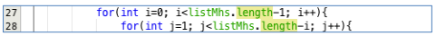

    a. Apakah perbedaan antara kegunaan perulangan i dan perulangan j?

    Jawab:

    Perulangan i mengatur jumlah iterasi total dalam algoritma bubble sort, di mana setiap iterasi akan berjalan sebanyak jumlah elemen dalam array. Sementara itu, perulangan j bertanggung jawab atas perbandingan elemen-elemen dalam setiap iterasi. Perulangan j dimulai dari indeks kedua hingga mencapai batas iterasi i (listMhs.length - i).

    b. Mengapa syarat dari perulangan i adalah i<listMhs.length-1 ?

    Jawab:

    Ketentuan tersebut diterapkan untuk memastikan bahwa perulangan tidak melampaui panjang array. Perulangan i dihentikan sebelum mencapai indeks terakhir karena elemen terakhir sudah dibandingkan dengan elemen sebelumnya.

    c. Mengapa syarat dari perulangan j adalah j<listMhs.length-i ?

    Jawab:

    Syarat tersebut berfungsi supaya perulangan tidak membandingkan indeks yang sudah dibandingan pada iterasi sebelumnya.

    d. Jika banyak data di dalam listMhs adalah 50, maka berapakali perulangan i akan
    berlangsung? Dan ada berapa Tahap bubble sort yang ditempuh?

    Jawab:

    perulangan i akan berjalan 49 kali

### 5.3 Mengurutkan Data Mahasiswa Berdasarkan IPK Menggunakan Selection Sort
Waktu : 30 menit\
Jika pada praktikum yang sebelumnya kita telah mengurutkan data mahasiwa berdasarkan
IPK menggunakan Bubble Sort secara descending, pada kali ini kita akan mencoba untuk
menambahkan fungsi pengurutan menggunakan Selection Sort.

### 5.3.1. Langkah-langkah Percobaan

Class pada kode program

```java
public class mahasiswa {
    String nama;
    int thnMasuk, umur;
    double IPK;

    mahasiswa(String n, int t, int u, double i) {
        nama = n;
        thnMasuk = t;
        umur = u;
        IPK = i;
    }

    void tampil() {
        System.out.println("Nama: " + nama);
        System.out.println("Tahun Masuk: " + thnMasuk);
        System.out.println("Umur: " + umur);
        System.out.println("IPK: " + IPK);
    }
}

```

```java
public class DaftarMahasiswaBerprestasi07 {
    mahasiswa[] listMhs = new mahasiswa[5];
    int idx;

    void tambah(mahasiswa m) {
        if (idx < listMhs.length) {
            listMhs[idx] = m;
            idx++;
        } else {
            System.out.println("Data sudah penuh");
        }
    }

    void tampil() {
        for (mahasiswa m : listMhs) {
            m.tampil();
            System.out.println("------------------------------");
        }
    }

    void bubbleSort() {
        for (int i = 0; i < listMhs.length - 1; i++) {
            for (int j = 1; j < listMhs.length - i; j++) {
                if (listMhs[j].IPK > listMhs[j - 1].IPK) { // descending
                    mahasiswa temp = listMhs[j];
                    listMhs[j] = listMhs[j - 1];
                    listMhs[j - 1] = temp;
                }
            }
        }
    }

    void selectionSort() {
        for (int i = 0; i < listMhs.length - 1; i++) {
            int idxMin = i;
            for (int j = i + 1; j < listMhs.length; j++) {
                if (listMhs[j].IPK < listMhs[idxMin].IPK) { // ascending
                    idxMin = j;
                }
            }
            // swap
            mahasiswa temp = listMhs[i];
            listMhs[i] = listMhs[idxMin];
            listMhs[idxMin] = temp;
        }
    }
}
```

Main pada kode program 

```java
public class main07 {
    public static void main(String[] args) {
        DaftarMahasiswaBerprestasi07 list = new DaftarMahasiswaBerprestasi07();
        mahasiswa m1 = new mahasiswa("Nusa", 2017, 25, 3);
        mahasiswa m2 = new mahasiswa("Rara", 2012, 19, 4);
        mahasiswa m3 = new mahasiswa("Dompu", 2018, 19, 3.5);
        mahasiswa m4 = new mahasiswa("Abdul", 2017, 23, 2);
        mahasiswa m5 = new mahasiswa("Ummi", 2019, 21, 3.75);

        list.tambah(m1);
        list.tambah(m2);
        list.tambah(m3);
        list.tambah(m4);
        list.tambah(m5);

        System.out.println("Data mahasiswa sebelum sorting = ");
        list.tampil();

        System.out.println("Data mahasiswa setelah sorting desc berdasarkan IPK");
        list.bubbleSort();
        list.tampil();

        System.out.println("Data mahasiswa setelah sorting asc berdasarkan IPK");
        list.selectionSort();
        list.tampil();
    }
}
```

### 5.3.2. Verifikasi Hasil Percobaan

Output sebelum

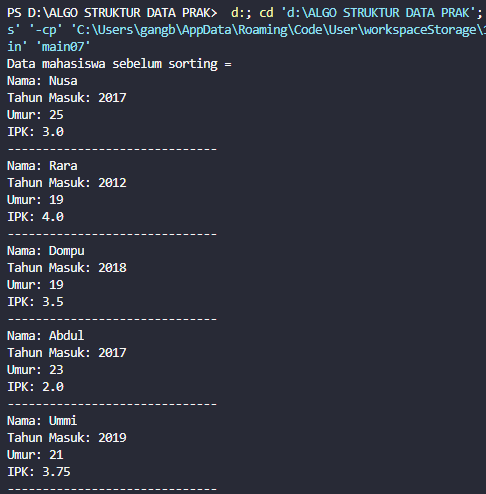

Output sesudah

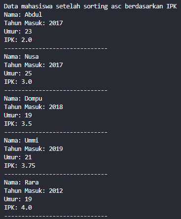

### 5.3.3. Pertanyaan

Di dalam method selection sort, terdapat baris program seperti di bawah ini:

Untuk apakah proses tersebut, jelaskan!

Jawab:

Program ini bertujuan untuk mencari nilai IPK terkecil dalam array listMhs dengan cara membandingkan nilai pada setiap indeks dalam array tersebut.

### 5.4 Mengurutkan Data Mahasiswa Berdasarkan IPK Menggunakan Insertion Sort
Waktu : 30 menit\
Yang terakhir akan diimplementasikan Teknik sorting menggunakan Insertion Sort, dengan
mengurutkan IPK mahasiswa secara ascending.

### 5.4.1 Langkah-langkah Percobaan

Class pada kode program

```java


public class mahasiswa {
    String nama;
    int thnMasuk, umur;
    double IPK;

    mahasiswa(String n, int t, int u, double i) {
        nama = n;
        thnMasuk = t;
        umur = u;
        IPK = i;
    }

    void tampil() {
        System.out.println("Nama: " + nama);
        System.out.println("Tahun Masuk: " + thnMasuk);
        System.out.println("Umur: " + umur);
        System.out.println("IPK: " + IPK);
    }
}
```
```java
public class DaftarMahasiswaBerprestasi07 {
    mahasiswa[] listMhs = new mahasiswa[5];
    int idx;

    void tambah(mahasiswa m) {
        if (idx < listMhs.length) {
            listMhs[idx] = m;
            idx++;
        } else {
            System.out.println("Data sudah penuh");
        }
    }

    void tampil() {
        for (mahasiswa m : listMhs) {
            m.tampil();
            System.out.println("------------------------------");
        }
    }

    void bubbleSort() {
        for (int i = 0; i < listMhs.length - 1; i++) {
            for (int j = 1; j < listMhs.length - i; j++) {
                if (listMhs[j].IPK > listMhs[j - 1].IPK) { // descending
                    mahasiswa temp = listMhs[j];
                    listMhs[j] = listMhs[j - 1];
                    listMhs[j - 1] = temp;
                }
            }
        }
    }

    void selectionSort() {
        for (int i = 0; i < listMhs.length - 1; i++) {
            int idxMin = i;
            for (int j = i + 1; j < listMhs.length; j++) {
                if (listMhs[j].IPK < listMhs[idxMin].IPK) { // ascending
                    idxMin = j;
                }
            }
            // swap
            mahasiswa temp = listMhs[i];
            listMhs[i] = listMhs[idxMin];
            listMhs[idxMin] = temp;
        }
    }

        void insertionSort() {
        for (int i = 1; i < listMhs.length; i++) {
            mahasiswa temp = listMhs[i];
            int j = i;
            while (j > 0 && listMhs[j - 1].umur > temp.umur) {
                listMhs[j] = listMhs[j - 1];
                j--;
            }
            listMhs[j] = temp;
        }
    }
}
```

Main pada kode program

```java
public class main07 {
    public static void main(String[] args) {
        DaftarMahasiswaBerprestasi07 list = new DaftarMahasiswaBerprestasi07();
        mahasiswa m1 = new mahasiswa("Nusa", 2017, 25, 3);
        mahasiswa m2 = new mahasiswa("Rara", 2012, 19, 4);
        mahasiswa m3 = new mahasiswa("Dompu", 2018, 19, 3.5);
        mahasiswa m4 = new mahasiswa("Abdul", 2017, 23, 2);
        mahasiswa m5 = new mahasiswa("Ummi", 2019, 21, 3.75);

        list.tambah(m1);
        list.tambah(m2);
        list.tambah(m3);
        list.tambah(m4);
        list.tambah(m5);

        System.out.println("Data mahasiswa sebelum sorting = ");
        list.tampil();

        System.out.println("Data mahasiswa setelah sorting desc berdasarkan IPK");
        list.bubbleSort();
        list.tampil();

        System.out.println("Data mahasiswa setelah sorting asc berdasarkan IPK");
        list.selectionSort();
        list.tampil();

        System.out.println("Data mahasiswa setelah sorting asc berdasarkan IPK");
        list.insertionSort();
        list.tampil();
    }
}
```


### 5.4.2 Verifikasi Hasil Percobaan

Output sebelum

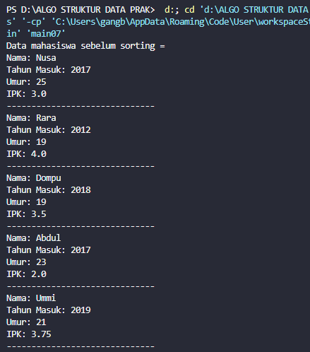

Output sesudah

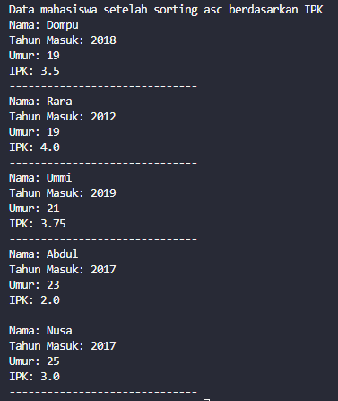

### 5.4.3 Pertanyaan

Ubahlah fungsi pada InsertionSort sehingga fungsi ini dapat melaksanakan proses sorting dengan cara descending

    ``` java
    void insertionSort(){
            for (int i = 1; i < listMahasiswa.length; i++) {
                Mahasiswa tmp = listMahasiswa[i];
                int j = i;
                while (j > 0 && listMahasiswa[j-1].ipk < tmp.ipk) { // merubah operator '>' menjadi '<'
                listMahasiswa[j] = listMahasiswa[j-1];
                    j--;
                }
                listMahasiswa[j] = tmp;
            }
        }
    ```

### 5.5 Latihan Praktikum

Waktu : 90 Menit\
    Sebuah platform travel yang menyediakan layanan pemesanan kebutuhan travelling sedang
    mengembangkan backend untuk sistem pemesanan/reservasi akomodasi (penginapan), salah satu fiturnya adalah menampilkan daftar penginapan yang tersedia berdasarkan pilihan filterb yang diinginkan user. Daftar penginapan ini harus dapat disorting berdasarkan

1. Harga dimulai dari harga termurah ke harga tertinggi.

2. Rating bintang penginapan dari bintang tertinggi (5) ke terendah (1)\
Buatlah proses sorting data untuk kedua filter tersebut dengan menggunakan algoritma bubble sort dan selection sort.
    
    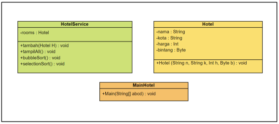


    Jawab:

    Class pada kode program

    ```java
    public class Hotel {
    String nama, kota;
    int harga;
    byte bintang;

    Hotel(String n, String k, int h, byte b) {
        nama = n;
        kota = k;
        harga = h;
        bintang = b;
        }
    }
    ```
    ```java
    public class HotelService {
    Hotel rooms[] = new Hotel[5];

    void tambah(Hotel h) {
        for (int i = 0; i < rooms.length; i++) {
            if (rooms[i] == null) {
                rooms[i] = h;
                break;
            }
        }
    }

    void tampilAll() {
        for (Hotel h : rooms) {
            System.out.println("Nama    : " + h.nama);
            System.out.println("Kota    : " + h.kota);
            System.out.println("Harga   : " + h.harga);
            System.out.println("Bintang : " + h.bintang);
            System.out.println("-------------------------");
        }
    }

    // Sorting dari harga termurah
    void selectionSort() {
        for (int i = 0; i < rooms.length - 1; i++) {
            int idxMin = i;
            for (int j = i + 1; j < rooms.length; j++) {
                if (rooms[j].harga < rooms[idxMin].harga) {
                    idxMin = j;
                }
            }
            Hotel temp = rooms[idxMin];
            rooms[idxMin] = rooms[i];
            rooms[i] = temp;
        }
    }

    // Sorting dari bintang tertinggi
    void bubbleSort() {
        for (int i = 0; i < rooms.length - 1; i++) {
            for (int j = 1; j < rooms.length - i; j++) {
                if (rooms[j].bintang > rooms[j - 1].bintang) {
                    Hotel temp = rooms[j];
                    rooms[j] = rooms[j - 1];
                    rooms[j - 1] = temp;
                    }
                }
            }
        }
    }
    ```

    Main pada kode program

    ```java
        //MainHotel.java
    public class MainHotel {
        public static void main(String[] args) {
            HotelService list = new HotelService();
    
            Hotel h1 = new Hotel("H1", "Bali", 1000000, (byte) 5);
            Hotel h2 = new Hotel("H2", "Batu", 750000, (byte) 4);
            Hotel h3 = new Hotel("H3", "Kediri", 600000, (byte) 3);
            Hotel h4 = new Hotel("H4", "Malang", 500000, (byte) 2);
            Hotel h5 = new Hotel("H4", "Blitar", 400000, (byte) 1);
    
            list.tambah(h2);
            list.tambah(h5);
            list.tambah(h3);
            list.tambah(h1);
            list.tambah(h4);
        
            System.out.println("Daftar hotel sebelum sorting:");
            list.tampilAll();
            System.out.println();
    
            System.out.println("Daftar hotel setelah sorting berdasarkan harga termurah:");
            list.selectionSort();
            list.tampilAll();

           System.out.println("Daftar hotel setelah sorting berdasarkan bintang:");
           list.bubbleSort();
           list.tampilAll(); 
        }
    }
    ```

    Output pada kode program

    a. Hotel sebelum sorting

    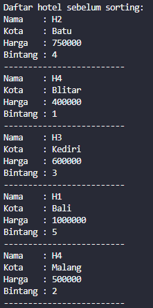

    b. Hotel setelah sorting berdasarkan harga termurah

    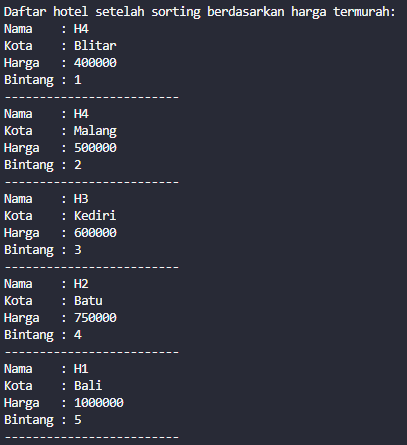

    c. Hotel setelah sorting berdasarkan bintang

    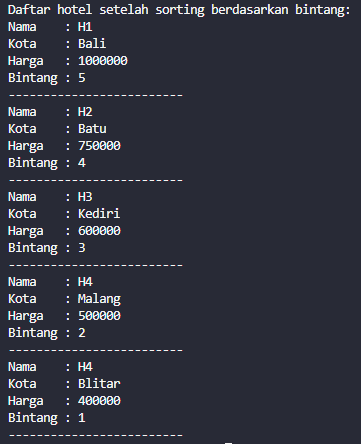
