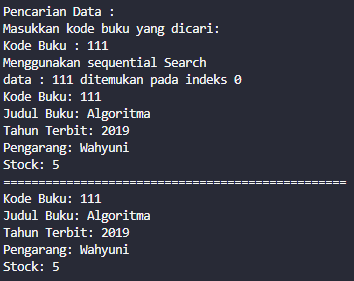

# JOBSHEET VI SEARCHING

Nama    : Cakra Wangsa M.A.W

Kelas   : TI_1H

Absen   : 07

NIM     : 2341720032

6.1. Tujuan Praktikum

Setelah melakukan materi praktikum ini, mahasiswa mampu:

1. Menjelaskan mengenai algoritma Searching.
2. Membuat dan mendeklarasikan struktur algoritma Searching.
3. Menerapkan dan mengimplementasikan algoritma Searching.

## 6.2. Searching / Pencarian Menggunakan Agoritma Sequential Search

### 6.2.1. Langkah-langkah Percobaan Sequential Search

##### Class Pada kode program

```java
package TestSearching.P7;

/**
 * Buku07
 */
public class Buku07 {

    int kodeBuku, tahunTerbit, stock ;
    String judulBuku, pengarang;
    
    public Buku07(int kodeBuku, int tahunTerbit, int stock, String judulBuku, String pengarang){
        this.judulBuku = judulBuku;
        this.kodeBuku = kodeBuku;
        this.tahunTerbit = tahunTerbit;
        this.stock = stock;
        this.pengarang = pengarang;
    }

    void tampilDataBuku(){
        System.out.println("===========================");
        System.out.println("Kode Buku: " + kodeBuku);
        System.out.println("Judul Buku: " + judulBuku);
        System.out.println("Tahun Terbit: " + tahunTerbit);
        System.out.println("Pengarang: " + pengarang);
        System.out.println("Stock: " + stock);
    }
}
```

```java
package TestSearching.P7;

public class PencarianBuku07 {
    
    Buku07 listBk[] = new Buku07[5];
    int idx;

    void tambah(Buku07 m){
        if (idx < listBk.length) {
            listBk[idx] = m;
            idx++;
        } else {
            System.out.println("Data sudah penuh");
        }
    }

    void tampil(){
        for(Buku07 m : listBk){
            m.tampilDataBuku();
        }
    }

    public int FindSeqSearch(int cari){
        int posisi = 0;
        for (int j = 0; j < listBk.length; j++) {
            if (listBk[j].kodeBuku == cari) {
                j = posisi;
            } else {
                posisi = -1;
            }
            break;
        } 
        return posisi;
    }

    public void Tampilposisi(int x, int pos){
        if (pos != -1) {
            System.out.println("Data : " + x + " ditemukan pada indeks " + pos);
        } else {
            System.out.println("Data : " + x + " tidak ditemukan");
        }
    }

}

```

###### Main pada kode program

```java
package TestSearching.P7;

import java.util.Scanner;

public class BukuMain07 {
  
    public static void main(String[] args) {
        Scanner s = new Scanner(System.in);
        Scanner s1 = new Scanner(System.in);
    
        PencarianBuku07 data = new PencarianBuku07();
        int jumBuku = 5;

        System.out.println("-------------------------------------------------------------------");
        System.out.println("MASUKKAN DATA BUKU SECARA URUT DARI KODE BUKU TERKECIL: ");
        for (int i = 0; i < jumBuku; i++) {
            System.out.println("---------------------");
            System.out.print("Kode Buku \t : ");
            int kodeBuku = s.nextInt();            
            System.out.print("Judul Buku \t : ");
            String judulBuku = s1.nextLine();
            System.out.print("Kode Terbit \t : ");
            int tahunTerbit = s.nextInt();            
            System.out.print("Pengarang \t : ");
            String pengarang = s1.nextLine();            
            System.out.print("Stock \t\t : ");
            int stock = s.nextInt();
            
            Buku07 m = new Buku07(kodeBuku, tahunTerbit, stock, judulBuku, pengarang);
            data.tambah(m);
        }

        
        System.out.println("-------------------------------------------------------------------");
        System.out.println("DATA KESELURUHAN BUKU : ");
        System.out.println("-------------------------------------------------------------------");
        data.tampil();
        System.out.println("--------------------------------------------------------------------");
        System.out.println("--------------------------------------------------------------------");
        System.out.println("PENCARIAN DATA : ");
        System.out.println("Masukkan kode buku yang dicari: ");
        System.out.print("Kode Buku: ");
        int cari = s.nextInt();
        System.out.println("Menggunakan sequential Search");
        int posisi = data.FindSeqSearch(cari);
        data.Tampilposisi(cari, posisi);
        
        s.close();
        s1.close();
    }

}
```

### 6.2.2. Verifikasi Hasil Percobaan


###### Output pada kode program

Output KodeBuku terkecil


Output data keseluruhan Buku


Output Pencarian Data Buku


Output Pencarian data Buku

a. data Buku ditemukan


b. Data Buku tidak ditemukan


### 6.2.3. Pertanyaan

1. Jelaskan fungsi break yang ada pada method FindSeqSearch!

    Jawab:
    Fungsi break yang berada pada method FindSeqSearch berfungsi menghentikan perulangan for apabila elemen yang dicari sudah ditemukan, dan memastikan nilai yang dikembalikan adalah posisi elemen yang dicari atau -1 elemen tidak ditemukan.

2. Jika Data Kode Buku yang dimasukkan tidak terurut dari kecil ke besar. Apakah program masih
dapat berjalan? Apakah hasil yang dikeluarkan benar? Tunjukkan hasil screenshoot untuk bukti dengan kode Buku yang acak. Jelaskan Mengapa hal tersebut bisa terjadi?

    Jawab:
    program masih bisa berjalan dan outputnya tetap sesuai. dikarenakan proses seqeuential search tidak memerlukan data yang terurut.





3. Buat method baru dengan nama FindBuku menggunakan konsep sequential search dengan tipe method dari FindBuku adalah BukuNoAbsen. Sehingga Anda bisa memanggil method tersebut pada class BukuMain seperti gambar berikut:


Method pada Pencarian Buku

```java
public Buku07 FindBuku(int cari) {
            Buku07 buku = null;
            for (int j = 0; j < listBk.length; j++) {
                if (listBk[j].kodeBuku == cari) {
                    buku = listBk[j];
                    break;
                }
            }
            return buku;
        }
```

Main pada class Buku
```java
Buku07 dataBuku = data.FindBuku(cari);
        if (dataBuku != null) {
            dataBuku.tampilDataBuku();
        } else {
            System.out.println("Buku dengan kode " + cari + " tidak ditemukan.");
        }
```


### 6.3. Searching / Pencarian Menggunakan Binary Search

### 6.3.1. Langkah-langkah Percobaan Binary Search

##### Class pada kode program

```java
package TestSearching.P7;

public class PencarianBuku07 {
        Buku07 listBk[] = new Buku07[5];
        int idx;
    
        void tambah(Buku07 m) {
            if (idx < listBk.length) {
                listBk[idx] = m;
                idx++;
            } else {
                System.out.println("Data sudah penuh");
            }
        }
    
        void tampil() {
            for (Buku07 m : listBk) {
                m.tampilDataBuku();
            }
        }
    
        public int FindSeqSearch(int cari) {
            int posisi = 2;
            for (int j = 0; j < listBk.length; j++) {
                if (listBk[j].kodeBuku == cari) {
                    posisi = j;
                    break;
                }
            }
            return posisi;
        }
    
        void Tampilposisi(int x, int pos) {
            if (pos != -1) {
                System.out.println("data : " + x + " ditemukan pada indeks " + pos);
            } else {
                System.out.println("data : " + x + " tidak ditemukan");
            }
        }
    
        public void TampilData(int x, int pos) {
            if (pos != -1) {
                System.out.println("Kode Buku: " + listBk[pos].kodeBuku);
                System.out.println("Judul Buku: " + listBk[pos].judulBuku);
                System.out.println("Tahun Terbit: " + listBk[pos].tahunTerbit);
                System.out.println("Pengarang: " + listBk[pos].pengarang);
                System.out.println("Stock: " + listBk[pos].stock);
            } else {
                System.out.println("data : " + x + " tidak ditemukan");
            }
        }
    
        public Buku07 FindBuku(int cari) {
            Buku07 buku = null;
            for (int j = 0; j < listBk.length; j++) {
                if (listBk[j].kodeBuku == cari) {
                    buku = listBk[j];
                    break;
                }
            }
            return buku;
        }
    
        public int FindBinarySearch(int cari, int left, int right) {
            int mid;
            if (right >= left) {
                mid = (left + right) / 2;
                if (listBk[mid].kodeBuku == cari) {
                    return mid;
                } else if (listBk[mid].kodeBuku > cari) {
                    return FindBinarySearch(cari, left, mid - 1);
                } else {
                    return FindBinarySearch(cari, mid + 1, right);
                }
            }
            return -1;
        }

    }
```

###### Main pada kode program

``` java
package TestSearching.P7;

import java.util.Scanner;

public class BukuMain07 {
  
     public static void main(String[] args) {
        Scanner s = new Scanner(System.in);
        Scanner s1 = new Scanner(System.in);

        PencarianBuku07 data = new PencarianBuku07();
        int jumBuku = 5;

        System.out.println("----------------------------------------------------------");
        System.out.println("Masukkan data Buku secara Urut dari KodeBuku Terkecil : ");
        for (int i = 0; i < jumBuku; i++) {
            System.out.println("----------------------------------------------------------");
            System.out.print("Kode Buku \t: ");
            int kodeBuku = s.nextInt();
            System.out.print("Judul Buku \t: ");
            String judulBuku = s1.nextLine();
            System.out.print("Tahun Terbit \t: ");
            int tahunTerbit = s.nextInt();
            System.out.print("Pengarang \t: ");
            String pengarang = s1.nextLine();
            System.out.print("Stock \t\t: ");
            int stock = s.nextInt();

            Buku07 m = new Buku07(kodeBuku, judulBuku, tahunTerbit, pengarang, stock);
            data.tambah(m);
        }

        System.out.println("----------------------------------------------------------");
        System.out.println("Data Keseluruhan Buku : ");
        data.tampil();

        System.out.println("----------------------------------------------------------");
        System.out.println("----------------------------------------------------------");
        System.out.println("Pencarian Data : ");
        System.out.println("Masukkan kode buku yang dicari: ");
        System.out.print("Kode Buku : ");
        int cari = s.nextInt();
        System.out.println("Menggunakan sequential Search");
        int posisi = data.FindSeqSearch(cari);
        data.Tampilposisi(cari, posisi);

        data.TampilData(cari, posisi);

        Buku07 dataBuku = data.FindBuku(cari);
        if (dataBuku != null) {
            dataBuku.tampilDataBuku();
        } else {
            System.out.println("Buku dengan kode " + cari + " tidak ditemukan.");
        }

        System.out.println("=========================================================");
        System.out.println("Menggunakan binary search");
        posisi = data.FindBinarySearch(cari, 0, jumBuku-1);
        data.Tampilposisi(cari, posisi);
        data.TampilData(cari, posisi);
    }

}
```

Output pada kode program


### 6.3.2. Verifikasi Hasil Percobaan

##### Output pada kode program


### 6.3.3. Pertanyaan

1. Tunjukkan pada kode program yang mana proses divide dijalankan!

    Jawab:  proses divide dijalankan pada saat menghitung nilai tengah berdasarkan pencarian dengan menggunakan operasi (left + right) / 2. Dan pada operasi ini membagi pencarian menjadi dua bagian.

2. Tunjukkan pada kode program yang mana proses conquer dijalankan!

    Jawab: proses conquer dijalankan pada saat melakukan dua pemanggilan rekursif pada metode FindBinarySearch dengan memperbarui nilai left dan right sesuai dengan hasil perbandingan nilai tengah listBk[mid].kodeBuku dengan cari.

3.Jika Kode Buku yang dimasukkan dari Kode Buku terbesar ke terkecil (missal : 20215, 20214, 20212, 20211, 20210) dan elemen yang dicari adalah 20210. Bagaimana hasil dari binary search? Apakah sesuai? Jika tidak sesuai maka ubahlah kode program binary seach agar hasilnya sesuai! 

    Jawab: Tidak sesuai


    
Kode yang telah dirubah. Disini ditambahkan program berupa bubble sort untuk mengurutkan inputan pengguna dari kodeBuku terkecil, sehingga meskipun pengguna menginputkan kode yang tidak diurutkan, program tetap bisa berjalan tanpa error.

```java
public int FindBinarySearch(int cari, int left, int right) {
            bubbleSortBuku();
            int mid;
            if (right >= left) {
                mid = (left + right) / 2;
                if (listBk[mid].kodeBuku == cari) {
                    return mid;
                } else if (listBk[mid].kodeBuku > cari) {
                    return FindBinarySearch(cari, left, mid - 1);
                } else {
                    return FindBinarySearch(cari, mid + 1, right);
                }
            }
            return -1;
        }
    
        void bubbleSortBuku() {
            for (int i = 0; i < listBk.length - 1; i++) {
                for (int j = 1; j < listBk.length - i; j++) {
                    if (listBk[j].kodeBuku < listBk[j - 1].kodeBuku) {
                        Buku07 tmp = listBk[j];
                        listBk[j] = listBk[j - 1];
                        listBk[j - 1] = tmp;
                    }
                }
            }
        }    
```

``` java
Buku07 dataBuku = data.FindBuku(cari);
        if (dataBuku != null) {
        dataBuku.tampilDataBuku();
        } else {
        System.out.println("Buku dengan kode " + cari + " tidak ditemukan.");
        }

    System.out.println("=========================================================");
    System.out.println("Menggunakan binary search");
    data.bubbleSortBuku();
    posisi = data.FindBinarySearch(cari, 0, jumBuku - 1);
    data.Tampilposisi(cari, posisi);
    data.TampilData(cari, posisi);
```

Output pada kode program   


4. Jika data Kode Buku yang dimasukkan tidak urut. Apakah program masih dapat berjalan? Mengapa demikian! Tunjukkan hasil screenshoot untuk bukti dengan kode Buku yang acak. Jelaskan Mengapa hal tersebut bisa terjadi?

    Jawab:

    Program pada Binary Search tidak akan bisa berjalan karena pada program Binary Search diperlukan data yang berurut dengan memulai dari yang terkecil hingga yang terbesar. jadi harus menambahkan program yang fungsinya untuk mengurutkan data pada input dari user agar program dapat berfungsi.

    


### 6.4. Percobaan Pengayaan Divide and Conquer

### 6.4.1. Langkah-langkah Percobaan Merge Sort

##### Kode program

Class pada kode program

```java
package TestSearching.P7;

public class MergeSorting07 {
 
    public void mergeSort(int[] data) {
        sort(data, 0, data.length - 1);
    }

    public void merge(int[] data, int left, int middle, int right) {
        int[] temp = new int[data.length];
        for (int i = left; i <= right; i++) {
            temp[i] = data[i];
        }
        int a = left;
        int b = middle + 1;
        int c = left;

        while (a <= middle && b <= right) {
            if (temp[a] < temp[b]) {
                data[c] = temp[a];
                a++;
            } else {
                data[c] = temp[b];
                b++;
            }
            c++;
        }

        int s = middle - a;
        for (int i = 0; i <= s; i++) {
            data[c + i] = temp[a + i];
        }
    }

    public void sort(int data[], int left, int right) {
        if (left < right) {
            int middle = (left + right) / 2;
            sort(data, left, middle);
            sort(data, middle + 1, right);
            merge(data, left, middle, right);
        }
    }

    public void printArray(int arr[]) {
        for (int i = 0; i < arr.length; i++) {
            System.out.print(arr[i] + " ");
        }
        System.out.println();
    }

}
```

Main pada kode program

```java
package TestSearching.P7;

public class MergeSortMain07 {
    
    public static void main(String[] args) {
        int data[] = { 10, 40, 30, 50, 70, 20, 100, 90 };
        System.out.println("Sorting dengan merge sort");
        MergeSorting07 mSort = new MergeSorting07();
        System.out.println("data awal");
        mSort.printArray(data);
        mSort.mergeSort(data);
        System.out.println("setelah diurutkan");
        mSort.printArray(data);
    }

}
```

### 6.4.2. Verifikasi Hasil Percobaan

Output pada kode program


### 6.5.Latihan Praktikum

1. Modifikasi percobaan searching diatas dengan ketentuan berikut ini
- Ubah tipe data dari kode Buku yang awalnya int menjadi String
- Tambahkan method untuk pencarian kode Buku (bertipe data String) dengan menggunakan sequential search dan binary search.

Class pada kode program

```java
package TestSearching.P7;

/**
 * Buku07
 */
public class Buku07 {

    String kodeBuku;
    String judulBuku;
    int tahunTerbit;
    String pengarang;
    int stock;

    public Buku07(String kodeBuku, String judulBuku, int tahunTerbit, String pengarang, int stock) {
        this.kodeBuku = kodeBuku;
        this.judulBuku = judulBuku;
        this.tahunTerbit = tahunTerbit;
        this.pengarang = pengarang;
        this.stock = stock;
    }

    public void tampilDataBuku() {
        System.out.println("=================================================");
        System.out.println("Kode Buku: " + kodeBuku);
        System.out.println("Judul Buku: " + judulBuku);
        System.out.println("Tahun Terbit: " + tahunTerbit);
        System.out.println("Pengarang: " + pengarang);
        System.out.println("Stock: " + stock);
    }
}
```

```java
package TestSearching.P7;

public class PencarianBuku07 {
    Buku07 listBk[] = new Buku07[5];
    int idx;

    void tambah(Buku07 m) {
        if (idx < listBk.length) {
            listBk[idx] = m;
            idx++;
        } else {
            System.out.println("Data sudah penuh");
        }
    }

    void tampil() {
        for (Buku07 m : listBk) {
            m.tampilDataBuku();
        }
    }

    public int FindSeqSearch(int cari) {
        int posisi = 2;
        for (int j = 0; j < listBk.length; j++) {
            if (Integer.parseInt(listBk[j].kodeBuku) == cari) {
                posisi = j;
                break;
            }
        }
        return posisi;
    }

    void Tampilposisi(int x, int pos) {
        if (pos != -1) {
            System.out.println("data : " + x + " ditemukan pada indeks " + pos);
        } else {
            System.out.println("data : " + x + " tidak ditemukan");
        }
    }

    public void TampilData(int x, int pos) {
        if (pos != -1) {
            System.out.println("Kode Buku: " + listBk[pos].kodeBuku);
            System.out.println("Judul Buku: " + listBk[pos].judulBuku);
            System.out.println("Tahun Terbit: " + listBk[pos].tahunTerbit);
            System.out.println("Pengarang: " + listBk[pos].pengarang);
            System.out.println("Stock: " + listBk[pos].stock);
        } else {
            System.out.println("data : " + x + " tidak ditemukan");
        }
    }

    public Buku07 FindBuku(int cari) {
        Buku07 buku = null;
        for (int j = 0; j < listBk.length; j++) {
            if (Integer.parseInt(listBk[j].kodeBuku) == cari) {
                buku = listBk[j];
                break;
            }
        }
        return buku;
    }

    public int FindBinarySearch(int cari, int left, int right) {
        bubbleSortBuku();
        int mid;
        if (right >= left) {
            mid = (left + right) / 2;
            if (Integer.parseInt(listBk[mid].kodeBuku) == cari) {
                return mid;
            } else if (Integer.parseInt(listBk[mid].kodeBuku) > cari) {
                return FindBinarySearch(cari, left, mid - 1);
            } else {
                return FindBinarySearch(cari, mid + 1, right);
            }
        }
        return -1;
    }

    void bubbleSortBuku() {
        for (int i = 0; i < listBk.length - 1; i++) {
            for (int j = 1; j < listBk.length - i; j++) {
                if (Integer.parseInt(listBk[j].kodeBuku) < Integer.parseInt(listBk[j - 1].kodeBuku)) {
                    Buku07 tmp = listBk[j];
                    listBk[j] = listBk[j - 1];
                    listBk[j - 1] = tmp;
                    }
                }
            }
        }
    }
```

Main pada kode program

```java
package TestSearching.P7;

import java.util.Scanner;

public class BukuMain07 {
  
    public static void main(String[] args) {
        Scanner s = new Scanner(System.in);
        Scanner s1 = new Scanner(System.in);

        PencarianBuku07 data = new PencarianBuku07();
        int jumBuku = 5;

        for (int i = 0; i < jumBuku; i++) {
            System.out.println("----------------------------------------------------------");
            System.out.println("Masukkan data Buku secara Urut dari KodeBuku Terkecil : ");
            System.out.println("----------------------------------------------------------");
            System.out.print("Kode Buku \t: ");
            String kodeBuku = s1.nextLine();
            System.out.print("Judul Buku \t: ");
            String judulBuku = s1.nextLine();
            System.out.print("Tahun Terbit \t: ");
            int tahunTerbit = s.nextInt();
            System.out.print("Pengarang \t: ");
            String pengarang = s1.nextLine();
            System.out.print("Stock \t\t: ");
            int stock = s.nextInt();

            Buku07 m = new Buku07(kodeBuku, judulBuku, tahunTerbit, pengarang, stock);
            data.tambah(m);
        }

        System.out.println("----------------------------------------------------------");
        System.out.println("Data Keseluruhan Buku : ");
        data.tampil();

        System.out.println("----------------------------------------------------------");
        System.out.println("----------------------------------------------------------");
        System.out.println("Pencarian Data : ");
        System.out.println("Masukkan kode buku yang dicari: ");
        System.out.print("Kode Buku : ");
        int cari = s.nextInt();
        System.out.println("Menggunakan sequential Search");
        int posisi = data.FindSeqSearch(cari);
        data.Tampilposisi(cari, posisi);

        data.TampilData(cari, posisi);

        Buku07 dataBuku = data.FindBuku(cari);
        if (dataBuku != null) {
            dataBuku.tampilDataBuku();
        } else {
            System.out.println("Buku dengan kode " + cari + " tidak ditemukan.");
        }

        System.out.println("=========================================================");
        System.out.println("Menggunakan binary search");
        data.bubbleSortBuku();
        posisi = data.FindBinarySearch(cari, 0, jumBuku - 1);
        data.Tampilposisi(cari, posisi);
        data.TampilData(cari, posisi);
    }

}
```

Output pada kode program


2.Modifikasi percobaan searching diatas dengan ketentuan berikut ini

- Tambahkan method pencarian judul buku menggunakan sequential search dan binary search. Sebelum dilakukan searching dengan binary search data harus dilakukan pengurutan dengan menggunakan algoritma Sorting (bebas pilih algoritma sorting apapun)! Sehingga ketika input data acak, maka algoritma searching akan tetap berjalan
- Buat aturan untuk mendeteksi hasil pencarian judul buku yang lebih dari 1 hasil dalam bentuk kalimat peringatan! Pastikan algoritma yang diterapkan sesuai dengan kasus yang diberikan!

Class pada kode program

```java
package TestSearching.P7;

public class PencarianBuku07 {

    Buku07 listBk[] = new Buku07[5];
    int idx;

    void tambah(Buku07 m) {
        if (idx < listBk.length) {
            listBk[idx] = m;
            idx++;
        } else {
            System.out.println("Data sudah penuh");
        }
    }

    void tampil() {
        for (Buku07 m : listBk) {
            m.tampilDataBuku();
        }
    }

    public int FindSeqSearchbyKodeBuku(int cari) {
        int posisi = 2;
        for (int j = 0; j < listBk.length; j++) {
            if (Integer.parseInt(listBk[j].kodeBuku) == cari) {
                posisi = j;
                break;
            }
        }
        return posisi;
    }

    void TampilposisiByKodeBuku(int x, int pos) {
        if (pos != -1) {
            System.out.println("data : " + x + " ditemukan pada indeks " + pos);
        } else {
            System.out.println("data : " + x + " tidak ditemukan");
        }
    }

    public void TampilDataByKodeBuku(int x, int pos) {
        if (pos != -1) {
            System.out.println("Kode Buku: " + listBk[pos].kodeBuku);
            System.out.println("Judul Buku: " + listBk[pos].judulBuku);
            System.out.println("Tahun Terbit: " + listBk[pos].tahunTerbit);
            System.out.println("Pengarang: " + listBk[pos].pengarang);
            System.out.println("Stock: " + listBk[pos].stock);
        } else {
            System.out.println("data : " + x + " tidak ditemukan");
        }
    }

    public void TampilPosisiByJudulBuku(String judul, int posisi) {
        if (posisi != -1) {
            System.out.println("Data buku dengan judul '" + judul + "' ditemukan pada indeks " + posisi);
        } else {
            System.out.println("Buku dengan judul '" + judul + "' tidak ditemukan.");
        }
    }

    public void TampilDataByJudulBuku(String judul, int posisi) {
        if (posisi != -1) {
            System.out.println("Kode Buku: " + listBk[posisi].kodeBuku);
            System.out.println("Judul Buku: " + listBk[posisi].judulBuku);
            System.out.println("Tahun Terbit: " + listBk[posisi].tahunTerbit);
            System.out.println("Pengarang: " + listBk[posisi].pengarang);
            System.out.println("Stock: " + listBk[posisi].stock);
        } else {
            System.out.println("Buku dengan judul '" + judul + "' tidak ditemukan.");
        }
    }

    public Buku07 FindBuku(int cari) {
        Buku07 buku = null;
        for (int j = 0; j < listBk.length; j++) {
            if (Integer.parseInt(listBk[j].kodeBuku) == cari) {
                buku = listBk[j];
                break;
            }
        }
        return buku;
    }

    public int FindBinarySearchByKodeBuku(int cari, int left, int right) {
        bubbleSortKodeBuku();
        int mid;
        if (right >= left) {
            mid = (left + right) / 2;
            if (Integer.parseInt(listBk[mid].kodeBuku) == cari) {
                return mid;
            } else if (Integer.parseInt(listBk[mid].kodeBuku) > cari) {
                return FindBinarySearchByKodeBuku(cari, left, mid - 1);
            } else {
                return FindBinarySearchByKodeBuku(cari, mid + 1, right);
            }
        }
        return -1;
    }

    void bubbleSortKodeBuku() {
        for (int i = 0; i < listBk.length - 1; i++) {
            for (int j = 1; j < listBk.length - i; j++) {
                if (Integer.parseInt(listBk[j].kodeBuku) < Integer.parseInt(listBk[j - 1].kodeBuku)) {
                    Buku07 tmp = listBk[j];
                    listBk[j] = listBk[j - 1];
                    listBk[j - 1] = tmp;
                }
            }
        }
    }

    public int findSeqSearchByJudulBuku(String judulBuku) {
        int posisi = -1;
        int count = 0;
        for (int j = 0; j < idx; j++) {
            if (listBk[j].judulBuku.equalsIgnoreCase(judulBuku)) {
                posisi = j;
                count++;
            }
        }
        if (count > 1) {
            System.out.println("Ditemukan " + count + " buku dengan judul \"" + judulBuku + "\".");
            System.out.println("Berikut daftar kode bukunya:");
            for (int j = 0; j < idx; j++) {
                if (listBk[j].judulBuku.equalsIgnoreCase(judulBuku)) {
                    System.out.println("Data: " + listBk[j].kodeBuku);
                }
            }
        }

        return posisi;
    }

    public int findBinarySearchByJudulBuku(String judulBuku) {
        insertionSortJudulBuku();

        int left = 0;
        int right = idx - 1;
        int posisi = -1;

        while (left <= right) {
            int mid = (left + right) / 2;
            if (listBk[mid].judulBuku.equalsIgnoreCase(judulBuku)) {
                posisi = mid;
                break;
            } else if (listBk[mid].judulBuku.compareToIgnoreCase(judulBuku) > 0) {
                right = mid - 1;
            } else {
                left = mid + 1;
            }
        }

        return posisi;
    }

    public void insertionSortJudulBuku() {
        for (int i = 1; i < idx; i++) {
            String temp = listBk[i].judulBuku;
            int j = i - 1;
            while (j >= 0 && listBk[j].judulBuku.compareToIgnoreCase(temp) > 0) {
                listBk[j + 1] = listBk[j];
                j--;
            }
            listBk[j + 1].judulBuku = temp;
        }
    }

}
```

Main pada kode program

```java
package TestSearching.P7;

import java.util.Scanner;

public class BukuMain07 {
  
    public static void main(String[] args) {
        Scanner s = new Scanner(System.in);
        Scanner s1 = new Scanner(System.in);

        PencarianBuku07 data = new PencarianBuku07();
        int jumBuku = 5;

        for (int i = 0; i < jumBuku; i++) {
            System.out.println("----------------------------------------------------------");
            System.out.println("Masukkan data Buku secara Urut dari KodeBuku Terkecil : ");
            System.out.println("----------------------------------------------------------");
            System.out.print("Kode Buku \t: ");
            String kodeBuku = s1.nextLine();
            System.out.print("Judul Buku \t: ");
            String judulBuku = s1.nextLine();
            System.out.print("Tahun Terbit \t: ");
            int tahunTerbit = s.nextInt();
            System.out.print("Pengarang \t: ");
            String pengarang = s1.nextLine();
            System.out.print("Stock \t\t: ");
            int stock = s.nextInt();

            Buku07 m = new Buku07(kodeBuku, judulBuku, tahunTerbit, pengarang, stock);
            data.tambah(m);
        }

        System.out.println("----------------------------------------------------------");
        System.out.println("Data Keseluruhan Buku : ");
        data.tampil();

        int pilihan = 0;
        do {
            System.out.println("----------------------------------------------------------");
            System.out.println("Menu Pilihan : ");
            System.out.println("----------------------------------------------------------");
            System.out.println("1. Cari Data Buku Berdasarkan Kode Buku");
            System.out.println("2. Cari Data Buku Berdasarkan Judul Buku");
            System.out.println("3. Exit");
            System.out.print("Pilihan: ");
            pilihan = s.nextInt();

            switch (pilihan) {
                case 1:
                    System.out.println("----------------------------------------------------------");
                    System.out.println("----------------------------------------------------------");
                    System.out.println("Pencarian Data : ");
                    System.out.println("Masukkan kode buku yang dicari: ");
                    System.out.print("Kode Buku : ");
                    int cari = s.nextInt();
                    System.out.println("Menggunakan sequential Search");
                    int posisi = data.FindSeqSearchbyKodeBuku(cari);
                    data.TampilposisiByKodeBuku(cari, posisi);
                    data.TampilDataByKodeBuku(cari, posisi);

                    Buku07 dataBuku = data.FindBuku(cari);
                    if (dataBuku != null) {
                        dataBuku.tampilDataBuku();
                    } else {
                        System.out.println("Buku dengan kode " + cari + " tidak ditemukan.");
                    }

                    System.out.println("=========================================================");
                    System.out.println("Menggunakan binary search");
                    data.bubbleSortKodeBuku();
                    posisi = data.FindBinarySearchByKodeBuku(cari, 0, jumBuku - 1);
                    data.TampilposisiByKodeBuku(cari, posisi);
                    data.TampilDataByKodeBuku(cari, posisi);
                    break;

                case 2:
                    System.out.println("----------------------------------------------------------");
                    System.out.println("----------------------------------------------------------");
                    System.out.println("Pencarian Data : ");
                    System.out.println("Masukkan judul buku yang dicari: ");
                    System.out.print("Judul Buku : ");
                    String cariJudul = s1.nextLine();
                    System.out.println();

                    System.out.println("Menggunakan sequential Search");
                    int posisiJudul = data.findSeqSearchByJudulBuku(cariJudul);
                    data.TampilPosisiByJudulBuku(cariJudul, posisiJudul);

                    System.out.println("=========================================================");
                    System.out.println("Menggunakan binary search");
                    data.insertionSortJudulBuku();
                    posisiJudul = data.findBinarySearchByJudulBuku(cariJudul);
                    data.TampilPosisiByJudulBuku(cariJudul, posisiJudul);
                    data.TampilDataByJudulBuku(cariJudul, posisiJudul);
                    break;

                case 3:
                    System.out.println("----------------------------------------------------------");
                    System.out.println("----------------------------------------------------------");
                    System.out.println("EXIT");
                    break;

                default:
                    System.out.println("Invalid choice. Please try again.");
                    break;
            }
        } while (pilihan != 3);
    }

}
```

Output pada kode program

