# JOBSHEET X QUEUE

Nama    : Cakra Wangsa M.A.W

Kelas   : TI_1H

Absen   : 07

NIM     : 2341720032


### 10.1 Tujuan Praktikum

Setelah melakukan materi praktikum ini, mahasiswa mampu:

1. Mengenal struktur data Queue
2. Membuat dan mendeklarasikan struktur data Queue
3. Menerapkan algoritma Queue dengan menggunakan array

### 10.2 Praktikum 1
Waktu percobaan : 45 menit
Pada percobaan ini, kita akan mengimplementasikan penggunaan class Queue.

### 10.2.1 Langkah-langkah Percobaan

Class pada kode program

```java
package minggu10.Prak1;

public class Queue07 {
    
    int[] data;
    int front;
    int rear;
    int size;
    int max;

    public Queue07(int n) {
        max = n;
        data = new int[max];
        size = 0;
        front = rear = -1;
    }

    public boolean IsEmpty() {
        if (size == 0) {
            return true;
        } else {
            return false;
        }
    }

    public boolean IsFull() {
        if (size == max) {
            return true;
        } else {
            return false;
        }
    }

    public void peek() {
        if (!IsEmpty()) {
            System.out.println("Elemen terdepan: " + data[front]);
        } else {
            System.out.println("Antrian kosong");
        }
    }

    public void print() {
        if (!IsEmpty()) {
            System.out.println("Queue masih kosong");
        } else {
            int i = front;
            while (i != rear) {
                System.out.println(data[i] + " ");
                i = (i + 1) % max;
            }
            System.out.println(data[i] + " ");
            System.out.println("Jumlah elemen = " + size);
        }
    }

    public void clear() {
        if (!IsEmpty()) {
            front = rear = -1;
            size = 0;
            System.out.println("Queue berhasil dikosongkan");
        } else {
            System.out.println("Queue masih kosong");
        }
    }

    public void Enqueue(int dt) {
        if (IsFull()) {
            System.out.println("Queue sudah penuh");
        } else {
            if (IsEmpty()) {
                front = rear = 0;
            } else {
                if (rear == max - 1) {
                    rear = 0;
                } else {
                    rear++;
                }
            }
            data[rear] = dt;
            size++;
        }
    }

    public int Dequeue() {
        int dt = 0;
        if (IsEmpty()) {
            System.out.println("Queue kosong");
        } else {
            dt = data[front];
            size--;
            if (IsEmpty()) {
                front = rear = -1;
            } else {
                if (front == max - 1) {
                    front = 0;
                } else {
                    front++;
                }
            }
        }
        return dt;
    }
    
}
```

Main pada kode program

```java
package minggu10.Prak1;

import java.util.Scanner;

public class QueueMain07 {
    

public static void menu() {
        System.out.println("Masukkan operasi yang diinginkan : ");
        System.out.println("1. Enqueue");
        System.out.println("2. Dequeue");
        System.out.println("3. Print");
        System.out.println("4. Peek");
        System.out.println("5. Clear");
        System.out.println("-------------------------------------");
    }

    public static void main(String[] args) {
        Scanner sc = new Scanner(System.in);

        System.out.print("Masukkan kapasitas queue : ");
        int n = sc.nextInt();

        Queue07 Q = new Queue07(n);
        int pilih;
        do {
            menu();
            pilih = sc.nextInt();
            switch (pilih) {
                case 1:
                    System.out.print("Masukkan data baru : ");
                    int dataMasuk = sc.nextInt();
                    Q.Enqueue(dataMasuk);
                    break;
                case 2:
                    int dataKeluar = Q.Dequeue();
                    if (dataKeluar != -1) {
                        System.out.println("Data yang dikeluarkan : " + dataKeluar);
                        break;
                    }
                case 3:
                    Q.print();
                    break;
                case 4:
                    Q.peek();
                    break;
                case 5:
                    Q.clear();
                    break;
            }
        } while (pilih == 1 || pilih == 2 || pilih == 3 || pilih == 4 || pilih == 5);
    }

}
```

### 10.2.2 Verifikasi Hasil Percobaan

Samakan hasil compile kode program Anda dengan gambar berikut ini.

Output pada kode program

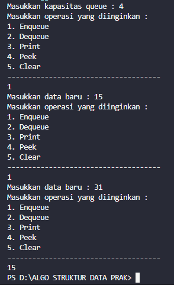


### 10.2.3 Pertanyaan

1. Pada konstruktor, mengapa nilai awal atribut front dan rear bernilai -1, sementara atribut size bernilai 0?

    Jawab: 
    Atribut Front dan rear diberikan nilai -1 berfungsi untuk memberikan tanda bahwa pada antrian sedang kosong. Yang mana front dan rear adalah posisi elemen pertama dan terakhir pada antrian. dan sementara pada atribut size diberikan nilai 0 dikarenakan jumlah elemen sebenernya yang ada dalam antrian pada saat konstruksi


2. Pada method Enqueue, jelaskan maksud dan kegunaan dari potongan kode berikut!

    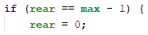

    Jawab:
    kegunaan dari kode program tersebut ialah untuk melakukan pengecekan apakah posisi terakhir dalam antrian sudah mencapai batas maksimum


3. Pada method Dequeue, jelaskan maksud dan kegunaan dari potongan kode berikut!

    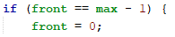

    Jawab:
    kegunaan pada kode program tersebut ialah untuk melakukan pemeriksaan apakah front sudah mencapai batas maksimum yang ada pada array 'data'

4. Pada method print, mengapa pada proses perulangan variabel i tidak dimulai dari 0 (int i=0), melainkan int i=front?

    Jawab:
    dikarenakan untuk menghindari iterasi ulang yang tidak perlu pada elemen yang telah dihapus sebelumnya dari antrian. Dengan begitu, proses pencetakan elemen yang saat ini didalam antrian dimulai dari posisi front yang merupakan elemen pertama saat itu

5. Perhatikan kembali method print, jelaskan maksud dari potongan kode berikut!

    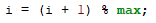

    Jawab: 
    kegunaan pada kode program tersebut ialah untuk menggeser indeks 'i' ke elemen berikutnya dalam array. Kode program akan memastikan perulangan akan mencapai elemen terakhir pada array.

6. Tunjukkan potongan kode program yang merupakan queue overflow!

    Jawab:

    ```java
        public boolean IsFull() {
        if (size == max) {
            return true;
        } else {
            return false;
        }
    }
    ```

7. Pada saat terjadi queue overflow dan queue underflow, program tersebut tetap dapat berjalan dan hanya menampilkan teks informasi. Lakukan modifikasi program sehingga pada saat terjadi queue overflow dan queue underflow, program dihentikan!

    Jawab:

    ```java
        public boolean IsEmpty() {
        if (size == 0) {
            System.out.println("Queue underflow!");
            System.exit(0);
            return true;
        } else {
            return false;
        }
    }

    public boolean IsFull() {
        if (size == max) {
            System.out.println("Queue overflow!");
            System.exit(0);
            return true;
        } else {
            return false;
        }
    }
    ```

### 10.3 Praktikum 2

Waktu percobaan : 45 menit
Pada percobaan ini, kita akan membuat program yang mengilustrasikan teller di bank dalam melayani nasabah.

### 10.3.1 Langkah-langkah Percobaan

Class pada kode program

```java
package minggu10.Prak2;

public class Nasabah07 {
    
    String norek, nama, alamat;
    int umur;
    double saldo;

    Nasabah07() {

    }

    Nasabah07(String norek, String nama, String alamat, int umur, double saldo) {
        this.norek = norek;
        this.nama = nama;
        this.alamat = alamat;
        this.umur = umur;
        this.saldo = saldo;
    }

}
```

```java
package minggu10.Prak2;

public class Queue07 {
    

    Nasabah07[] data;
    int front, rear, size, max;

    Queue07(int n) {
        max = n;
        data = new Nasabah07[max];
        size = 0;
        front = rear = -1;
    }

    public boolean isFull() {
        if (size == max) {
            return true;
        } else {
            return false;
        }
    }

    public boolean isEmpty() {
        if (size == 0) {
            return true;
        } else {
            return false;
        }
    }

    void enqueue(Nasabah07 dt) {
        if (isFull()) {
            System.out.println("Queue sudah penuh");
            System.exit(1);
        } else {
            if (isEmpty()) {
                front = rear = 0;
            } else {
                if (rear == max - 1) {
                    rear = 0;
                } else {
                    rear++;
                }
            }
            data[rear] = dt;
            size++;
        }
    }

    public Nasabah07 dequeue() {
        Nasabah07 dt = new Nasabah07();
        if (isEmpty()) {
            System.out.println("Queue masih kosong");
            System.exit(1);
        } else {
            dt = data[front];
            size--;
            if (isEmpty()) {
                front = rear = -1;
            } else {
                if (front == max - 1) {
                    front = 0;
                } else {
                    front++;
                }
            }
        }
        return dt;
    }

    void peek() {
        if (!isEmpty()) {
            System.out.println("Elemen terdepan : " + data[front].norek + " " + data[front].nama + " "
                    + data[front].alamat + " " + data[front].umur + " " + data[front].saldo);
        } else {
            System.out.println("Queue masih kosong");
        }
    }

    void print() {
        if (isEmpty()) {
            System.out.println("Queue masih kosong");
        } else {
            int i = front;
            while (i != rear) {
                System.out.println(data[i].norek + " " + data[i].nama + " "
                        + data[i].alamat + " " + data[i].umur + " " + data[i].saldo);
                i = (i + 1) % max;
            }
            System.out.println(data[i].norek + " " + data[i].nama + " "
                    + data[i].alamat + " " + data[i].umur + " " + data[i].saldo);
            System.out.println("Jumlah elemen = " + size);
        }
    }

    void clear() {
        if (!isEmpty()) {
            front = rear = -1;
            size = 0;
            System.out.println("Queue berhasil dikosongkan");
        } else {
            System.out.println("Queue masih kosong");
        }
    }

}
```


Main pada kode program

```java
package minggu10.Prak2;

import java.util.Scanner;

public class QueueMain07 {
    
public static void menu() {
        System.out.println("Pilih menu : ");
        System.out.println("1. Antrian baru");
        System.out.println("2. Antrian keluar");
        System.out.println("3. Cek antrian terdepan");
        System.out.println("4. Cek semua atrian");
        System.out.println("----------------------------------");
    }

    public static void main(String[] args) {
        Scanner sc = new Scanner(System.in);
        Scanner sc2 = new Scanner(System.in);
        System.out.print("Masukkan kapasitas queue : ");
        int jumlah = sc.nextInt();

        Queue07 Q = new Queue07(jumlah);

        int pilih = 0;
        do {
            menu();
            pilih = sc.nextInt();
            switch (pilih) {
                case 1:
                    System.out.print("No rekening : ");
                    String norek = sc2.nextLine();
                    System.out.print("Nama : ");
                    String nama = sc2.nextLine();
                    System.out.print("Alamat : ");
                    String alamat = sc2.nextLine();
                    System.out.print("Umur : ");
                    int umur = sc.nextInt();
                    sc.nextLine(); // tambahkan ini
                    System.out.print("Saldo : ");
                    int saldo = sc.nextInt();
                    sc.nextLine(); // dan ini
                    Nasabah07 nb = new Nasabah07(norek, nama, alamat, umur, saldo);
                    Q.enqueue(nb);
                    break;

                case 2:
                    Nasabah07 data = Q.dequeue();
                    if (!"".equals(data.norek) && !"".equals(data.nama) && !"".equals(data.alamat) && data.umur != 0
                            && data.saldo != 0) {
                        System.out.println("Data yang dikeluarkan : " + data.norek + " " + data.nama + " " + data.alamat
                                + " " + data.umur + " " + data.saldo);
                    }
                    break;
                case 3:
                    Q.peek();
                    break;
                case 4:
                    Q.print();
                    break;
                default:
                    break;
            }
        } while (pilih == 1 || pilih == 2 || pilih == 3 || pilih == 4);
    }

}
```

### 10.3.2 Verifikasi Hasil Percobaan
Samakan hasil compile kode program Anda dengan gambar berikut ini.

Output pada kode program

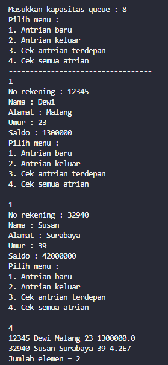

### 10.3.3 Pertanyaan

1. Pada class QueueMain, jelaskan fungsi IF pada potongan kode program berikut!

    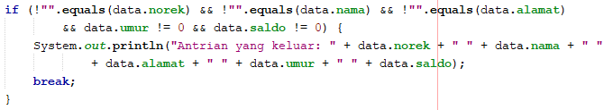

    Jawab: 
    Kegunaan IF pada kode program tersebut berfungsi untuk memastikan mengenai data yang keluar pada antrian queue setelah melakukan dequeue data yang valid dan bukan merupakan data yang kosong, dan jika data yang dikeluarkan merupakan data yang valid, maka data akan dicetak pada layar


2. Lakukan modifikasi program dengan menambahkan method baru bernama peekRear pada class Queue yang digunakan untuk mengecek antrian yang berada di posisi belakang! Tambahkan pula daftar menu 5. Cek Antrian paling belakang pada class QueueMain sehingga method peekRear dapat dipanggil!

    Jawab: 

    Pada Class Queue

    ```java
    void peekRear() {
        if (!isEmpty()) {
            System.out.println("Elemen paling belakang : " + data[rear].norek + " " + data[rear].nama + " "
                    + data[rear].alamat + " " + data[rear].umur + " " + data[rear].saldo);
        } else {
            System.out.println("Queue masih kosong");
        }
    }
    ```

    Pada Main Queue

    ```java
    package minggu10.Prak2;

    import java.util.Scanner;

    public class QueueMain07 {
        
    public static void menu() {
            System.out.println("Pilih menu : ");
            System.out.println("1. Antrian baru");
            System.out.println("2. Antrian keluar");
            System.out.println("3. Cek antrian terdepan");
            System.out.println("4. Cek semua antrian");
            System.out.println("5. Cek antrian belakang");
            System.out.println("----------------------------------");
        }

        public static void main(String[] args) {
            Scanner sc = new Scanner(System.in);
            Scanner sc2 = new Scanner(System.in);
            System.out.print("Masukkan kapasitas queue : ");
            int jumlah = sc.nextInt();

            Queue07 Q = new Queue07(jumlah);

            int pilih = 0;
            do {
                menu();
                pilih = sc.nextInt();
                switch (pilih) {
                    case 1:
                        System.out.print("No rekening : ");
                        String norek = sc2.nextLine();
                        System.out.print("Nama : ");
                        String nama = sc2.nextLine();
                        System.out.print("Alamat : ");
                        String alamat = sc2.nextLine();
                        System.out.print("Umur : ");
                        int umur = sc.nextInt();
                        sc.nextLine(); // tambahkan ini
                        System.out.print("Saldo : ");
                        int saldo = sc.nextInt();
                        sc.nextLine(); // dan ini
                        Nasabah07 nb = new Nasabah07(norek, nama, alamat, umur, saldo);
                        Q.enqueue(nb);
                        break;

                    case 2:
                        Nasabah07 data = Q.dequeue();
                        if (!"".equals(data.norek) && !"".equals(data.nama) && !"".equals(data.alamat) && data.umur != 0
                                && data.saldo != 0) {
                            System.out.println("Data yang dikeluarkan : " + data.norek + " " + data.nama + " " + data.alamat
                                    + " " + data.umur + " " + data.saldo);
                        }
                        break;
                    case 3:
                        Q.peek();
                        break;
                    case 4:
                        Q.print();
                        break;
                    case 5:
                        Q.peekRear();
                        break;
                    case 6:
                        System.exit(1);
                        break;
                    default:
                        break;
                }
            } while (pilih == 1 || pilih == 2 || pilih == 3 || pilih == 4);
        }

    }


    ```

Output pada kode program

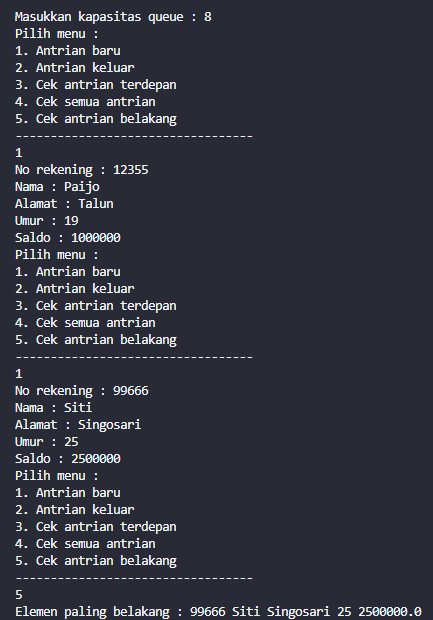


### 10.4 Tugas

1. Buatlah program antrian untuk mengilustasikan pesanan disebuah warung. Ketika seorang pembeli akan mengantri, maka dia harus mendaftarkan nama, dan nomor HP seperti yang digambarkan pada Class diagram berikut:

    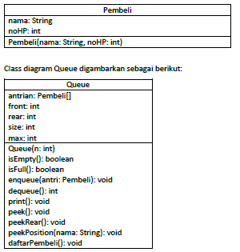

Keterangan:

• Method create(), isEmpty(), isFull(), enqueue(), dequeue() dan print(), kegunaannya sama seperti yang telah dibuat pada Praktikum

• Method peek(): digunakan untuk menampilkan data Pembeli yang berada di posisi antrian paling depan

• Method peekRear(): digunakan untuk menampilkan data Pembeli yang berada di posisi antrian paling belakang

• Method peekPosition(): digunakan untuk menampilkan seorang pembeli (berdasarkan nama) posisi antrian ke berapa

• Method daftarPembeli(): digunakan untuk menampilkan data seluruh pembeli


Class pada Pembeli07

```java
    String nama;
    int noHP;

    public pembeli(String nama, int noHP) {
        this.nama = nama;
        this.noHP = noHP;
    }
    
    pembeli(){
        
    }
```

Class pada Queue

```java
package minggu10.Tugas;

public class queue {
    

    Pembeli07[] antrian;
    int front, rear, size, max;

    public queue(int n){
        max = n;
        antrian = new Pembeli07[max];
        size = 0;
        front = rear = -1;  
    }

    public boolean isEmpty(){
        if (size == 0) {
            return true;
        } else {
            return false;            
        }
    }

    public boolean isFull(){
        if (size == max) {
            return true;
        } else {
            return false;
        }
    }

    public void enqueue(Pembeli07 antri){
        if (isFull()) {
            System.out.println("Queue sudah penuh");
            System.exit(0); //menghentikan program
        } else {
            if (isEmpty()) {
                front = rear = 0;
            } else {
                if (rear == max - 1) {
                    rear = 0;
                } else {
                    rear++;
                }
            }
            antrian[rear] = antri;
            size++;
        }
    }

    public Pembeli07 dequeue(){
        Pembeli07 antri = new Pembeli07();
        if (isEmpty()) {
            System.out.println("Queue masih kosong");
            System.exit(0); //menghentikan program
        } else {
            antri = antrian[front];
            size--;
            if (isEmpty()) {
                front = rear = -1;
            } else {
                if (front == max - 1) {
                    front = 0;
                } else {
                    front++;
                }
            }
        }
        return antri;
    }

    public void print(){
        if (isEmpty()) {
            System.out.println("Queue masih kosong");
        } else {
            int i = front;
            while (i != rear) {
                System.out.println(antrian[i].nama + " ");
                i = (i + 1) % max;
            }
            System.out.println(antrian[i].nama + " ");
            System.out.println("Jumlah elemen = " + size);
        }
    }

    public void peek(){
        if (!isEmpty()) {
            System.out.println("Elemen terdepan: " +  "\nNama: "+antrian[front].nama + "\nNo HP" + antrian[front].noHP);
        } else {
            System.out.println("Queue masih kosong");
        }
    }

    public void peekRear(){
        if (!isEmpty()) {
            System.out.println("Elemen terbelakang: " + "\nNama: " + antrian[rear].nama + " \nNo HP: " + antrian[rear].noHP);
        } else {
            System.out.println("Queue masih kosong");
        }
    }

    public int peekPosition(String nama){
        if (isEmpty()) {
            return -1; // Kembalikan -1 jika antrian kosong
        }
        int pos = -1; // Inisialisasi posisi dengan -1 (tidak ditemukan)
        int index = front;
        int count = 0;
        while (index != rear){
            if (antrian[index].nama.equals(nama)) {
                pos = count; // Simpan posisi saat nama ditemukan
                break;
            }
            index = (index + 1) % max; // Geser ke elemen berikutnya dalam antrian
            count++;
        } if (antrian[index].nama.equals(nama)) {
            pos = count;
        }
        if (pos != -1) {
            System.out.println("Pembeli dengan nama " + nama + " ditemukan di antrian ke-" + (pos + 1));
            System.out.println("Detail Pembeli:");
            System.out.println("Nama: " + antrian[(front + pos) % max].nama);
            System.out.println("No HP: " + antrian[(front + pos) % max].noHP);
        } else {
            System.out.println("Pembeli dengan nama " + nama + " tidak ditemukan dalam antrian");
        }
        return pos; // Kembalikan posisi, -1 jika tidak ditemukan
    }

    public void daftarPembeli(){
        if (isEmpty()) {
            System.out.println("Queue masih kosong");
        } else {
            System.out.println("Daftar Pembeli:");
            int i = front;
            do {
                System.out.println("Nama: " + antrian[i].nama + " \nNo HP: " + antrian[i].noHP);
                i = (i + 1) % max;
                System.out.println("===============");
            } while (i != (rear + 1) % max);
        }
    }

}
```

Main pada PembeliMain07

```java
package minggu10.Tugas;

import java.util.Scanner;

public class PembeliMain07 {
    
public static void menu(){
        System.out.println("Pilih Menu: ");
        System.out.println("1. Antrian Baru");
        System.out.println("2. Cek Antrian terdepan");
        System.out.println("3. Cek Antrian terbelakang");
        System.out.println("4. Cari Pembeli berdasarkan Nama");
        System.out.println("5. Tampilkan seluruh data");
        System.out.println("---------------------------");
    }

    public static void main(String[] args) {
        Scanner sc = new Scanner(System.in);

        System.out.print("Masukkan kapasitas queue: ");
        int jumlah = sc.nextInt();
        queue antri = new queue(jumlah);

        int pilih;

        do {
            menu();
            pilih = sc.nextInt();
            sc.nextLine();
            switch (pilih) {
                case 1:
                    System.out.print("Nama: ");
                    String nama = sc.nextLine();
                    System.out.print("No HP: ");
                    int noHP = sc.nextInt();
                    Pembeli07 pb = new Pembeli07(nama, noHP);
                    sc.nextLine();
                    antri.enqueue(pb);
                    break;
                case 2:
                    antri.peek();
                    break;
                case 3:
                    antri.peekRear();
                    break;
                case 4:
                    System.out.print("Cari Nama Pembeli: ");
                    String cari = sc.nextLine();
                    int pos = antri.peekPosition(cari);
                    break;
                case 5:
                    antri.daftarPembeli();
                    break;
            }
        } while (pilih != 0);
        sc.close();
    }

}
```

Output pada kode program

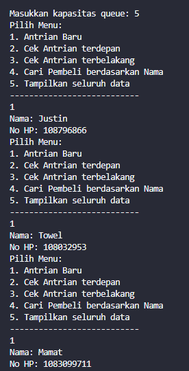
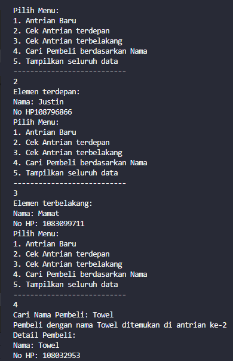
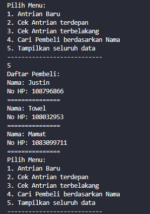


