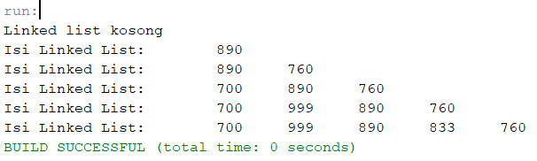
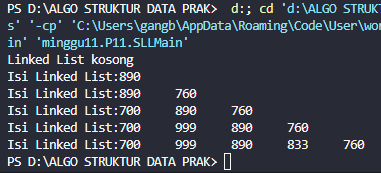
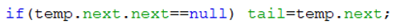
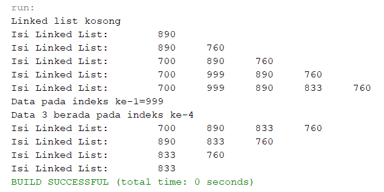
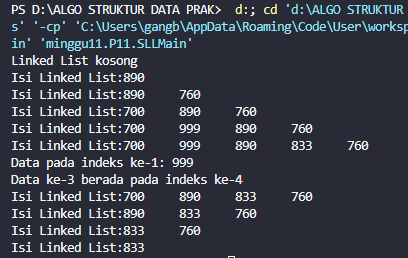
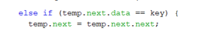

# JOBSHEET XI LINKED LIST

Nama    : Cakra Wangsa M.A.W

Kelas   : TI_1H

Absen   : 07

NIM     : 2341720032


### 1. Tujuan Praktikum

Setelah melakukan materi praktikum ini, mahasiswa mampu:

1. Membuat struktur data linked list
2. Membuat linked list pada program
3. Membedakan permasalahan apa yang dapat diselesaikan menggunakan linked list

### 2. Praktikum


### 2.1 Pembuatan Single Linked List

##### Class pada kode Program

pada Node.java
```java
package minggu11.P11;

public class Node07 {
    
int data;
Node07 next;

Node07 (int nilai, Node07 berikutnya) {
    data = nilai;
    next = berikutnya;
    }
}
```

pada SingleLinkedList.java

```java
package minggu11.P11;

public class SingleLinkList {

    Node07 head, tail;

    boolean isEmpty() {
        return head == null;
    }

    void print() {
        if (!isEmpty()) {
            Node07 tmp = head;
            System.out.print("Isi Linked List:");
            while (tmp != null) {
                System.out.print(tmp.data + "\t");
                tmp = tmp.next;
            }
            System.out.println(" ");
        } else {
            System.out.println("Linked List kosong");
        }
    }

    void addFirst(int input) {
        Node07 ndInput = new Node07(input, head);
        if (isEmpty()) {
            head = ndInput;
            tail = ndInput;
        } else {
            head = ndInput;
        }
    }

    void addLast(int input) {
        Node07 ndInput = new Node07(input, null);
        if (isEmpty()) {
            head = ndInput;
        } else {
            tail.next = ndInput;
        }
        tail = ndInput;
    }

    void insertAfter(int key, int input) {
        Node07 ndInput = new Node07(input, head);
        Node07 temp = head;
        while (temp != null) {
            if (temp.data == key) {
                ndInput.next = temp.next;
                temp.next = ndInput;
                if (ndInput.next == null) {
                    tail = ndInput;
                }
                break; 
            }
            temp = temp.next;
        }        
    }

    void insertAt(int index, int input) {
        if (index < 0) {
            System.out.println("index harus >= 0");
            return;
        }
        if (index == 0) {
            addFirst(input);
            return;
        }
        Node07 temp = head;
        for (int i = 1; i < index && temp.next != null; i++) {
            temp = temp.next;
        }
        Node07 ndInput = new Node07(input, temp.next);
        temp.next = ndInput;
        if (ndInput.next == null) {
            tail = ndInput; 
        }
    }    
}
```

###### Main pada kode program

pada SLLMain

```java
package minggu11.P11;

public class SLLMain {
public static void main(String[] args) {
    SingleLinkList singLL = new SingleLinkList();
        singLL.print();
        singLL.addFirst(890);
        singLL.print();
        singLL.addLast(760);
        singLL.print();
        singLL.addFirst(700);
        singLL.print();
        singLL.insertAfter(700, 999);
        singLL.print();
        singLL.insertAt(3, 833);
        singLL.print();
    }

}
```

### 2.1.1 Verifikasi Hasil Percobaan

Cocokkan hasil compile kode program anda dengan gambar berikut ini.


Output pada kode program



### 2.1.2 Pertanyaan

1. Mengapa hasil compile kode program di baris pertama menghasilkan “Linked List Kosong”?

    Jawab: metode isEmpty() digunakan untuk mengetahui apakah daftar terkait kosong. Dalam hal ini, head akan menjadi null hanya jika daftar terkait masih kosong, dan jika daftar terkait memiliki minimal satu node, head akan menunjuk ke node pertama.

    Namun, setelah membuat objek SingleLinkedList, ketika kita memanggil method print() dalam program utama, head belum diinisialisasi (masih null), sehingga method isEmpty() mengembalikan benar, dan pesan "Linked List Kosong" dicetak.

2. Jelaskan kegunaan variable temp secara umum pada setiap method!

    Jawab: Variabel temp (temporary/sementara) digunakan sebagai tempat penyimpanan sementara nilai atau hasil antara dalam suatu operasi atau proses sebelum ditetapkan pada variabel lain atau digunakan dalam langkah selanjutnya di dalam sebuah metode atau fungsi.

3. Perhatikan class SingleLinkedList, pada method insertAt Jelaskan kegunaan kode berikut


    Jawab: pada kode tersebut pada method insertAt berfungsi untuk memeriksa apakah node yang ditambahkan akan menjadi node terakhir dalam linked list setelah proses penyisipan.


### 2.2 Modifikasi Elemen pada Single Linked List

Didalam praktikum ini, kita akan mempraktekkan bagaimana mengakses elemen, mendapatkan
indeks dan melakukan penghapusan data pada Single Linked List.

##### Class pada kode program

pada Node07.java

```java
package minggu11.P11;

public class Node07 {
    
int data;
Node07 next;

Node07 (int nilai, Node07 berikutnya) {
    data = nilai;
    next = berikutnya;
    }
}
```

Pada SingleLinkList.java

```java
package minggu11.P11;

public class SingleLinkList {

    Node07 head, tail;

    boolean isEmpty() {
        return head == null;
    }

    void print() {
        if (!isEmpty()) {
            Node07 tmp = head;
            System.out.print("Isi Linked List:");
            while (tmp != null) {
                System.out.print(tmp.data + "\t");
                tmp = tmp.next;
            }
            System.out.println(" ");
        } else {
            System.out.println("Linked List kosong");
        }
    }

    void addFirst(int input) {
        Node07 ndInput = new Node07(input, head);
        if (isEmpty()) {
            head = ndInput;
            tail = ndInput;
        } else {
            head = ndInput;
        }
    }

    void addLast(int input) {
        Node07 ndInput = new Node07(input, null);
        if (isEmpty()) {
            head = ndInput;
        } else {
            tail.next = ndInput;
        }
        tail = ndInput;
    }

    void insertAfter(int key, int input) {
        Node07 ndInput = new Node07(input, head);
        Node07 temp = head;
        while (temp != null) {
            if (temp.data == key) {
                ndInput.next = temp.next;
                temp.next = ndInput;
                if (ndInput.next == null) {
                    tail = ndInput;
                }
                break; 
            }
            temp = temp.next;
        }        
    }

    void insertAt(int index, int input) {
        if (index < 0) {
            System.out.println("index harus >= 0");
            return;
        }
        if (index == 0) {
            addFirst(input);
            return;
        }
        Node07 temp = head;
        for (int i = 1; i < index && temp.next != null; i++) {
            temp = temp.next;
        }
        Node07 ndInput = new Node07(input, temp.next);
        temp.next = ndInput;
        if (ndInput.next == null) {
            tail = ndInput; 
        }
    }
    
     int getData(int index) {
        if (index < 0) {
            System.out.println("Indeks tidak valid");
            return -1;
        }
        Node07 tmp = head;
        for (int i = 0; i < index && tmp != null; i++) {
            tmp = tmp.next;
        }
        if (tmp != null) {
            return tmp.data;
        } else {
            System.out.println("Indeks melebihi panjang linked list");
            return -1;
        }
    }

    int indexOf(int key) {
        Node07 tmp = head;
        int index = 0;
        while (tmp != null && tmp.data != key) {
            tmp = tmp.next;
            index++;
        }
        if (tmp != null) {
            return index;
        } else {
            System.out.println("Data tidak ditemukan");
            return -1;
        }
    }

    void removeFirst() {
        if (isEmpty()) {
            System.out.println("Linked list masih kosong, tidak dapat dihapus");
        } else if (head == tail) {
            head = tail = null;
        } else {
            head = head.next;
        }
    }

    void removeLast() {
        if (isEmpty()) {
            System.out.println("Linked list masih kosong, tidak dapat dihapus");
        } else if (head == tail) {
            head = tail = null;
        } else {
            Node07 temp = head;
            while (temp.next != tail) {
                temp = temp.next;
            }
            temp.next = null;
            tail = temp;
        }
    }

    void remove(int key) {
        if (!isEmpty()) {
            Node07 temp = head;
            while (temp != null) {
                if (temp.data == key) {
                    if (temp == head) {
                        removeFirst();
                    } else {
                        Node07 prev = head;
                        while (prev.next != temp) {
                            prev = prev.next;
                        }
                        prev.next = temp.next;
                        if (temp == tail) {
                            tail = prev;
                        }
                    }
                    break;
                }
                temp = temp.next;
            }
        } else {
            System.out.println("Linked list masih kosong, tidak dapat dihapus");
        }
    }

    public void removeAt(int index) {
        if (index < 0) {
            System.out.println("Indeks tidak valid");
            return;
        }
        if (index == 0) {
            removeFirst();
        } else {
            Node07 temp = head;
            for (int i = 0; i < index - 1 && temp != null; i++) {
                temp = temp.next;
            }
            if (temp == null || temp.next == null) {
                System.out.println("Indeks melebihi panjang linked list");
                return;
            }
            temp.next = temp.next.next;
            if (temp.next == null) {
                tail = temp;
            }
        }
    }
}
```

##### Main pada kode program

Main pada SLLMain.java

```java
package minggu11.P11;

public class SLLMain {
public static void main(String[] args) {
    SingleLinkList singLL = new SingleLinkList();
        singLL.print();
        singLL.addFirst(890);
        singLL.print();
        singLL.addLast(760);
        singLL.print();
        singLL.addFirst(700);
        singLL.print();
        singLL.insertAfter(700, 999);
        singLL.print();
        singLL.insertAt(3, 833);
        singLL.print();

        System.out.println("Data pada indeks ke-1: " +singLL.getData(1));
        System.out.println("Data ke-3 berada pada indeks ke-" + singLL.indexOf(760));

        singLL.remove(999);
        singLL.print();
        singLL.removeAt(0);
        singLL.print();
        singLL.removeFirst();
        singLL.print();
        singLL.removeLast();
        singLL.print(); 
    }

}
```

##### 2.2.2 Verifikasi Hasil Percobaan


output pada kode program


Cocokkan hasil compile kode program anda dengan gambar berikut ini.

##### 2.2.3 Pertanyaan

1. Mengapa digunakan keyword break pada fungsi remove? Jelaskan!

    Jawab: Keyword `break` dalam fungsi `remove` digunakan untuk keluar dari perulangan setelah elemen yang ingin dihapus ditemukan, meningkatkan efisiensi dengan menghindari iterasi yang tidak diperlukan setelah elemen tersebut dihapus, sehingga operasi penghapusan hanya dilakukan sekali pada elemen yang dimaksud dan tidak membuang sumber daya komputasi dengan melanjutkan pencarian yang tidak lagi relevan setelah elemen target sudah berhasil dihapus dari daftar atau struktur data.

2. Jelaskan kegunaan kode dibawah pada method remove
    

    Jawab: 
    Dalam metode remove(int key), kode else if (temp.next.data == key) berfungsi untuk menemukan node yang memiliki nilai yang sama dengan key setelah node saat ini (temp). Setelah node yang sesuai ditemukan, operasi ini menghapus node tersebut dari daftar yang terhubung dengan mengatur next dari node saat ini (temp) ke node setelah node yang akan dihapus (temp.next.next).