# JOBSHEET XII DOUBLE LINKED LIST

Nama    : Cakra Wangsa M.A.W

Kelas   : TI_1H

Absen   : 07

NIM     : 2341720032

### 12.1 Tujuan Praktikum

Setelah melakukan praktikum ini, mahasiswa mampu:

1. memahami algoritma double linked lists;

2. membuat dan mendeklarasikan struktur algoritma double linked lists;

3. menerapkan algoritma double linked lists dalam beberapa study case.

### 12.2 Kegiatan Praktikum 1

Waktu : 90 Menit

### 12.2.1 Percobaan 1

##### Class pada kode program (Node)

```java
package minggu12.doublelinkedlists;

public class Node {
    int data;
    Node prev, next;

    Node (Node prev, int data, Node next){
        this.prev = prev;
        this.data = data;
        this.next = next;
    }
}
```

##### Class pada kode program (DoubleLinkedLists)

```java
package minggu12.doublelinkedlists;

public class DoubleLinkedLists {
    
    Node head;
    int size;

public DoubleLinkedLists() {
    head = null;
    size = 0;
    }

public boolean isEmpty() {
    return head == null;
    }

public void addFirst (int item) {
    if(isEmpty()) {
        head = new Node (null, item, null);
    } else {
        Node newNode = new Node (null, item, head);
        head.prev = newNode;
        head = newNode;
    }
    size++;
    }

public void addlast (int item) {
    if(isEmpty()) {
        addFirst(item);
    } else {
        Node current = head;
        while(current.next != null) {
            current = current.next;
        }
        Node newNode = new Node (current, item, null);
        current.next = newNode;
        size++;
        }
    }

public void add (int item, int index) throws Exception {
    if(isEmpty()) {
        addFirst(item);
    } else if(index < 0 || index > size) {
        throw new Exception("Nilai indeks diluar batas");
    }else{
        Node current = head;
        int i = 0;
        while (i < index) {
            current = current.next;
            i++;
        }
    if (current.prev == null) {
        Node newNode = new Node (null, item, current);
        current.prev = newNode;
        head = newNode;
    }else{
        Node newNode = new Node (current.prev, item, current);
        newNode.prev = current.prev;
        newNode.next = current;
        current.prev.next = newNode;
        current.prev = newNode;
            }
       
        }
        size++;
    }

public int size() {
    return size;
    }

public void clear() {
    head = null;
    size = 0;
    }

public void print() {
    if(!isEmpty()) {
        Node tmp = head;
        while (tmp != null) {
            System.out.print(tmp.data + "\t");
            tmp = tmp.next;
        }
        System.out.println("\nberhasil diisi");
    } else {
        System.out.println("Linked List Kosong");
        }
    }
}
```

##### Main pada kode program

```java
package minggu12.doublelinkedlists;

public class DoubleLinkedListsMain {

public static void main(String[] args) throws Exception {
     DoubleLinkedLists dll = new DoubleLinkedLists();
     dll.print();
     System.out.println("Size  : " + dll.size());
     System.out.println("=============================================");
     dll.addFirst(3);
     dll.addlast(4);
     dll.addFirst(7);
     dll.print();
     System.out.println("Size  : " + dll.size());
    System.out.println("=============================================");
    dll.add (40, 1);
     dll.print();
    System.out.println("Size  : " + dll.size());
    System.out.println("=============================================");
     dll.clear();
     dll.print();
    System.out.println("Size  : " + dll.size());

    }
}
```

### 12.2.2 Verifikasi Hasil Percobaan
Verifikasi hasil kompilasi kode program Anda dengan gambar berikut ini.
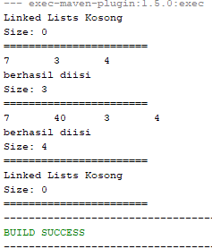

Output pada kode program

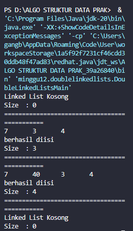

#### 12.2.3 Pertanyaan Percobaan

1. Jelaskan perbedaan antara single linked list dengan double linked lists!

    Jawab: 

2. Perhatikan class Node, di dalamnya terdapat atribut next dan prev. Untuk apakah atribut tersebut?

3. Perhatikan konstruktor pada class DoubleLinkedLists. Apa kegunaan inisialisasi atribut head dan size seperti pada gambar berikut ini?

    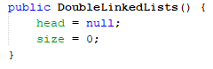

4. Pada method addFirst(), kenapa dalam pembuatan object dari konstruktor class Node prev dianggap sama dengan null?
Node newNode = new Node(null, item, head);

5. Perhatikan pada method addFirst(). Apakah arti statement head.prev = newNode ?

6. Perhatikan isi method addLast(), apa arti dari pembuatan object Node dengan mengisikan parameter prev dengan current, dan next dengan null?
Node newNode = new Node(current, item, null);

7. Pada method add(), terdapat potongan kode program sebagai berikut:
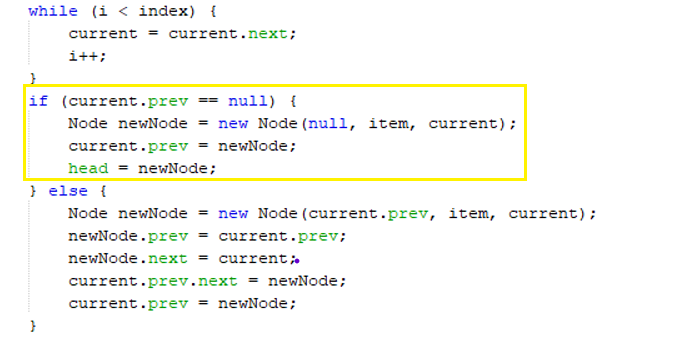
jelaskan maksud dari bagian yang ditandai dengan kotak kuning.

### 12.3 Kegiatan Praktikum 2

Waktu : 60 Menit

### 12.3.1 Tahapan Percobaan

Pada praktikum 2 ini akan dibuat beberapa method untuk menghapus isi LinkedLists pada class DoubleLinkedLists. Penghapusan dilakukan dalam tiga cara di bagian paling depan, paling belakang, dan sesuai indeks yang ditentukan pada linkedLists.

##### Class pada kode program (Node)

```java
package minggu12.doublelinkedlists;

public class Node {
    int data;
    Node prev, next;

    Node (Node prev, int data, Node next){
        this.prev = prev;
        this.data = data;
        this.next = next;
    }
}
```

##### Class pada kode program (DuobleLinkedList)

```java
package minggu12.doublelinkedlists;

public class DoubleLinkedLists {
    
    Node head;
    int size;

public DoubleLinkedLists() {
    head = null;
    size = 0;
    }

public boolean isEmpty() {
    return head == null;
    }

public void addFirst (int item) {
    if(isEmpty()) {
        head = new Node (null, item, null);
    } else {
        Node newNode = new Node (null, item, head);
        head.prev = newNode;
        head = newNode;
    }
    size++;
    }

public void addlast (int item) {
    if(isEmpty()) {
        addFirst(item);
    } else {
        Node current = head;
        while(current.next != null) {
            current = current.next;
        }
        Node newNode = new Node (current, item, null);
        current.next = newNode;
        size++;
        }
    }

public void add (int item, int index) throws Exception {
    if(isEmpty()) {
        addFirst(item);
    } else if(index < 0 || index > size) {
        throw new Exception("Nilai indeks diluar batas");
    }else{
        Node current = head;
        int i = 0;
        while (i < index) {
            current = current.next;
            i++;
        }
    if (current.prev == null) {
        Node newNode = new Node (null, item, current);
        current.prev = newNode;
        head = newNode;
    }else{
        Node newNode = new Node (current.prev, item, current);
        newNode.prev = current.prev;
        newNode.next = current;
        current.prev.next = newNode;
        current.prev = newNode;
            }
       
        }
        size++;
    }

public int size() {
    return size;
    }

public void clear() {
    head = null;
    size = 0;
    }

public void print() {
    if(!isEmpty()) {
        Node tmp = head;
        while (tmp != null) {
            System.out.print(tmp.data + "\t");
            tmp = tmp.next;
        }
        System.out.println("\nberhasil diisi");
    } else {
        System.out.println("Linked List Kosong");
        }
    }

    // Penambahan praktikum percobaan 2
public void removeFirst() throws Exception {
    if (isEmpty()) {
        throw new Exception("Linked List masih kosong, tidak dapat dihapus");
    } else if (size == 1) {
        removeLast();
    } else {
        head = head.next;
        head.prev = null;
        size--;
        }
    }

public void removeLast() throws Exception {
    if (isEmpty()) {
        throw new Exception ("Linked List masih kosong, tidak dapat dihapus");
    } else if (head.next == null) {
        head = null;
        size--;
        return;
    }

    Node current = head;
    while (current.next.next != null) {
        current = current.next;
    }
    current.next = null;
    size--;
    }

public void removeAt(int index) throws Exception {
    if (isEmpty() || index >= size) {
        throw new Exception("Nilai indeks diluar batas");
    } else if (index == 0) {
        removeFirst();
    } else {
        Node current = head;
        int i = 0;
        while (i < index) {
            current = current.next;
            i++;
        }
        if (current.next == null) {
            current.prev.next= null;
        } else if (current.prev == null) {
            current = current.next;
            current.prev=null;
            head = current;
        } else {
            current.prev.next = current.next;
            current.next.prev = current.prev;
        }
        size--;
        }
    }
}
```

##### Main pada kode program (DoubleLinkedListMain)

```java
package minggu12.doublelinkedlists;

public class DoubleLinkedListsMain {

public static void main(String[] args) throws Exception {
     DoubleLinkedLists dll = new DoubleLinkedLists();
     dll.print();
     System.out.println("Size  : " + dll.size());
     System.out.println("=============================================");
     dll.addFirst(3);
     dll.addlast(4);
     dll.addFirst(7);
     dll.print();
     System.out.println("Size  : " + dll.size());
    System.out.println("=============================================");
    dll.add (40, 1);
     dll.print();
    System.out.println("Size  : " + dll.size());
    System.out.println("=============================================");
     dll.clear();
     dll.print();
    System.out.println("Size  : " + dll.size());
    //penambahan praktikum percobaan 2 
    dll.addlast(50);
    dll.addlast(40);
    dll.addlast(10);
    dll.addlast(20);
    dll.print();
    System.out.println("Size  : " + dll.size());
    System.out.println("=============================================");
    dll.removeFirst();
    dll.print();
    System.out.println("Size  : " + dll.size());
    System.out.println("=============================================");
    dll.removeLast();
    dll.print();
    System.out.println("Size  : " + dll.size());
    System.out.println("=============================================");
    dll.removeAt(1);
    dll.print();
    System.out.println("Size  : " + dll.size());
    System.out.println("=============================================");
    }
}
```

### 12.3.2 Verifikasi Hasil Percobaan

Verifikasi hasil kompilasi kode program Anda dengan gambar berikut ini.
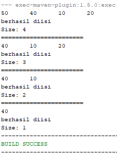

##### Output pada kode program

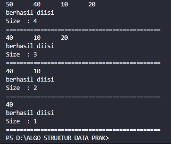

### 12.3.3 Pertanyaan Percobaan

1. Apakah maksud statement berikut pada method removeFirst()?
head = head.next;
head.prev = null;

2. Bagaimana cara mendeteksi posisi data ada pada bagian akhir pada method removeLast()?

3. Jelaskan alasan potongan kode program di bawah ini tidak cocok untuk perintah remove!

    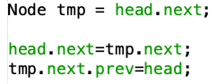
4. Jelaskan fungsi kode program berikut ini pada fungsi remove!
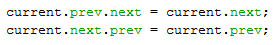


### 12.4 Kegiatan Praktikum 3

Waktu : 50 Menit

### 12.4.1 Tahapan Percobaan
Pada praktikum 3 ini dilakukan uji coba untuk mengambil data pada linked list dalam 3 kondisi, yaitu mengambil data paling awal, paling akhir dan data pada indeks tertentu dalam linked list. Method mengambil data dinamakan dengan get. Ada 3 method get yang dibuat pada praktikum ini sesuai dengan diagram class DoubleLinkedLists.

##### Class pada kode program (Node)

```java
package minggu12.doublelinkedlists;

public class Node {
    int data;
    Node prev, next;

    Node (Node prev, int data, Node next){
        this.prev = prev;
        this.data = data;
        this.next = next;
    }
}
```

##### Class pada kode program (DoubleLinkedLists)

```java
package minggu12.doublelinkedlists;

public class DoubleLinkedLists {
    
    Node head;
    int size;

public DoubleLinkedLists() {
    head = null;
    size = 0;
    }

public boolean isEmpty() {
    return head == null;
    }

public void addFirst (int item) {
    if(isEmpty()) {
        head = new Node (null, item, null);
    } else {
        Node newNode = new Node (null, item, head);
        head.prev = newNode;
        head = newNode;
    }
    size++;
    }

public void addlast (int item) {
    if(isEmpty()) {
        addFirst(item);
    } else {
        Node current = head;
        while(current.next != null) {
            current = current.next;
        }
        Node newNode = new Node (current, item, null);
        current.next = newNode;
        size++;
        }
    }

public void add (int item, int index) throws Exception {
    if(isEmpty()) {
        addFirst(item);
    } else if(index < 0 || index > size) {
        throw new Exception("Nilai indeks diluar batas");
    }else{
        Node current = head;
        int i = 0;
        while (i < index) {
            current = current.next;
            i++;
        }
    if (current.prev == null) {
        Node newNode = new Node (null, item, current);
        current.prev = newNode;
        head = newNode;
    }else{
        Node newNode = new Node (current.prev, item, current);
        newNode.prev = current.prev;
        newNode.next = current;
        current.prev.next = newNode;
        current.prev = newNode;
            }
       
        }
        size++;
    }

public int size() {
    return size;
    }

public void clear() {
    head = null;
    size = 0;
    }

public void print() {
    if(!isEmpty()) {
        Node tmp = head;
        while (tmp != null) {
            System.out.print(tmp.data + "\t");
            tmp = tmp.next;
        }
        System.out.println("\nberhasil diisi");
    } else {
        System.out.println("Linked List Kosong");
        }
    }

    // Penambahan praktikum percobaan 2
public void removeFirst() throws Exception {
    if (isEmpty()) {
        throw new Exception("Linked List masih kosong, tidak dapat dihapus");
    } else if (size == 1) {
        removeLast();
    } else {
        head = head.next;
        head.prev = null;
        size--;
        }
    }

public void removeLast() throws Exception {
    if (isEmpty()) {
        throw new Exception ("Linked List masih kosong, tidak dapat dihapus");
    } else if (head.next == null) {
        head = null;
        size--;
        return;
    }

    Node current = head;
    while (current.next.next != null) {
        current = current.next;
    }
    current.next = null;
    size--;
    }

public void removeAt(int index) throws Exception {
    if (isEmpty() || index >= size) {
        throw new Exception("Nilai indeks diluar batas");
    } else if (index == 0) {
        removeFirst();
    } else {
        Node current = head;
        int i = 0;
        while (i < index) {
            current = current.next;
            i++;
        }
        if (current.next == null) {
            current.prev.next= null;
        } else if (current.prev == null) {
            current = current.next;
            current.prev=null;
            head = current;
        } else {
            current.prev.next = current.next;
            current.next.prev = current.prev;
        }
        size--;
        }
    }

    // Penambahan praktikum percobaan 3

    // method getfirst
    public int getFirst() throws Exception {
        if (isEmpty()) {
            throw new Exception ("Linked List Kosong");
        } else {
            return head.data;
        }
    }
    // method getlast
    public int getLast() throws Exception {
        if (isEmpty()) {
            throw new Exception ("Linked List Kosong");
        }
        Node tmp = head;
        while (tmp.next != null) {
            tmp = tmp.next;
        }
        return tmp.data;
    }

    // method getindex
    public int get(int index) throws Exception {
        if (isEmpty() || index >= size) {
            throw new Exception ("Nilai indeks diluar batas");
        } 
            Node tmp = head;
            for (int i = 0; i < index; i++) {
                tmp = tmp.next;
            }
            return tmp.data;
        
    }
}
```

##### Main pada kode program (DoubleLinkedListsMain)

```java
package minggu12.doublelinkedlists;

public class DoubleLinkedListsMain {

public static void main(String[] args) throws Exception {
     DoubleLinkedLists dll = new DoubleLinkedLists();
     dll.print();
     System.out.println("Size  : " + dll.size());
     System.out.println("=============================================");
     dll.addFirst(3);
     dll.addlast(4);
     dll.addFirst(7);
     dll.print();
     System.out.println("Size  : " + dll.size());
    System.out.println("=============================================");
    dll.add (40, 1);
     dll.print();
    System.out.println("Size  : " + dll.size());
    System.out.println("=============================================");
     dll.clear();
     dll.print();
    System.out.println("Size  : " + dll.size());
    //penambahan praktikum percobaan 2 
    dll.addlast(50);
    dll.addlast(40);
    dll.addlast(10);
    dll.addlast(20);
    dll.print();
    System.out.println("Size  : " + dll.size());
    System.out.println("=============================================");
    dll.removeFirst();
    dll.print();
    System.out.println("Size  : " + dll.size());
    System.out.println("=============================================");
    dll.removeLast();
    dll.print();
    System.out.println("Size  : " + dll.size());
    System.out.println("=============================================");
    dll.removeAt(1);
    dll.print();
    System.out.println("Size  : " + dll.size());
    System.out.println("=============================================");
    //penambahan praktikum percobaan 3
    dll.print();
    System.out.println("Size  : " + dll.size());
    System.out.println("=============================================");
    dll.addFirst(3);
    dll.addlast(4);
    dll.addFirst(7);
    dll.print();
    System.out.println("Size  : " + dll.size());
    System.out.println("=============================================");
    dll.add (40, 1);
    dll.print();
    System.out.println("Size  : " + dll.size());
    System.out.println("=============================================");
    System.out.println("Data awal pada Linked Lists adalah: " + dll.getFirst());
    System.out.println("Data akhir pada Linked Lists adalah: " + dll.getLast());
    System.out.println("Data indeks ke-1 pada Linked Lists adalah: " + dll.get(1));
    System.out.println("=============================================");
    }   
}
```

### 12.4.2 Verifikasi Hasil Percobaan
Verifikasi hasil kompilasi kode program Anda dengan gambar berikut ini.
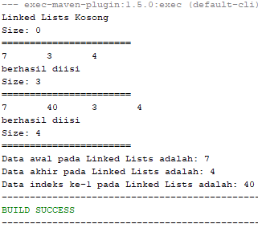

Output pada kode program
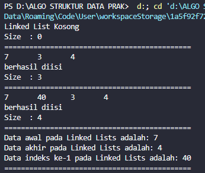

### 12.4.3 Pertanyaan Percobaan

1. Jelaskan method size() pada class DoubleLinkedLists!

2. Jelaskan cara mengatur indeks pada double linked lists supaya dapat dimulai dari indeks ke- 1!

3. Jelaskan perbedaan karakteristik fungsi Add pada Double Linked Lists dan Single Linked Lists!

4. Jelaskan perbedaan logika dari kedua kode program di bawah ini!
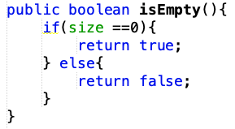 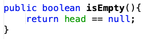


### 12.5 Tugas Praktikum

Waktu : 100 Menit

1. Buat program antrian vaksinasi menggunakan queue berbasis double linked list sesuai ilustrasi dan menu di bawah ini! (counter jumlah antrian tersisa di menu cetak(3) dan data orang yang telah divaksinasi di menu Hapus Data(2) harus ada)
Contoh Ilustrasi Program
Menu Awal dan Penambahan Data
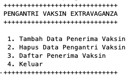 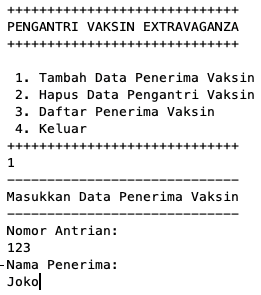


Cetak Data (Komponen di area merah harus ada)

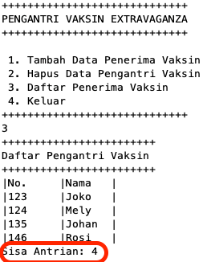

Hapus Data (Komponen di area merah harus ada)
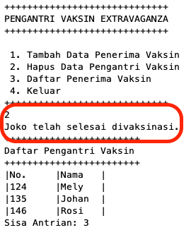

2.Buatlah program daftar film yang terdiri dari id, judul dan rating menggunakan double linked lists, bentuk program memiliki fitur pencarian melalui ID Film dan pengurutan Rating secara descending. Class Film wajib diimplementasikan dalam soal ini.
##### Contoh Ilustrasi Program
Menu Awal dan Penambahan Data
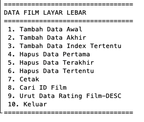 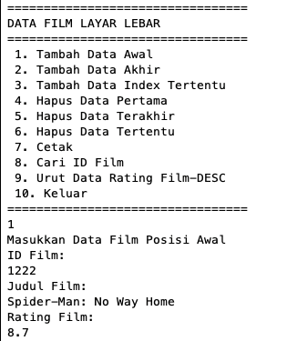 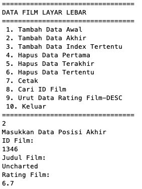 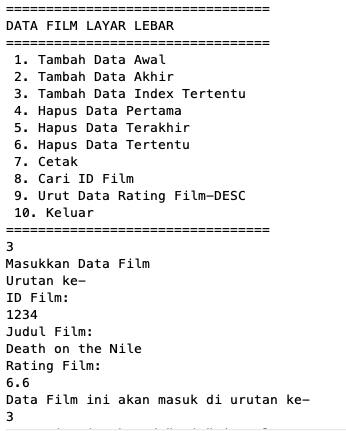

Cetak Data

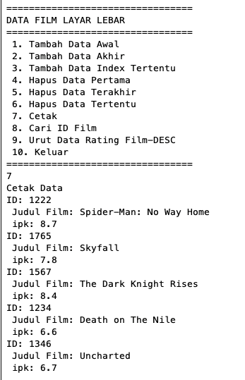

Pencarian Data

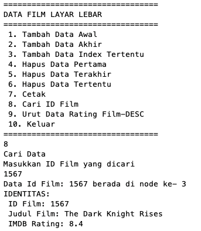