# JOBSHEET XV GRAPH

Nama    : Cakra Wangsa M.A.W

Kelas   : TI_1H

Absen   : 07

NIM     : 2341720032

### 1. Tujuan Praktikum

Setelah melakukan praktikum ini, mahasiswa mampu:

1. memahami model graph
2. membuat dan mendeklarasikan struktur algoritma graph
3. menerapkan algoritma dasar graph dalam beberapa studi kasus


### 2. Praktikum

### 2.1 Percobaan 1: Implementasi Graph menggunakan Linked List

### 2.1.1 Langkah-langkah Percobaan

    Waktu percobaan (90 menit)

##### Class pada kode program

Class pada Node 

```java
package minggu15.prak1;

public class Node07 {
    int data;
    Node07 prev, next;
    int jarak;

    Node07 (Node07 prev, int data,int jarak, Node07 next) {
        this.prev = prev;
        this.data = data;
        this.next = next;
        this.jarak = jarak;
    }
}
```

Class pada Graph

```java
package minggu15.prak1;

public class Graph07 {
    
    int vertex;
    DoubleLinkedList07 list[];

    public Graph07(int v) {
        vertex = v;
        list = new DoubleLinkedList07[v];
        for (int i = 0; i < v; i++) {
            list[i] = new DoubleLinkedList07();
        }
    }

    public void addEdge(int asal, int tujuan, int jarak) {
        list[asal].addFirst(tujuan, jarak);
        // list[tujuan].addFirst(asal, jarak);
    }

    public void degree(int asal) throws Exception {
        int k, totalIn = 0, totalOut = 0;
        for (int i = 0; i < vertex; i++) {
            //inDegree
        for (int j = 0; j < list[i].size(); j++) {
            if (list[i].get(j) == asal) {
                ++totalIn;
            }
    }

    //outDegree
        for (k = 0; k < list[asal].size(); k++) {
            list[asal].get(k);   
    }
    totalOut = k;
    }

    System.out.println("InDegree dari Gedung " + (char) ('A' + asal) + "    : " + totalIn);
    System.out.println("OutDegree dari Gedung " + (char) ('A' + asal) + "   : " + totalOut);
    System.out.println("Degree dari Gedung " + (char) ('A' + asal) + "      : " + (totalIn + totalOut));
    //System.out.println("Degree dari gedung " + (char) ('A' + asal) + " : " + list [asal].size);   
}
    public void removeEdge(int asal, int tujuan) throws Exception {
        for (int i = 0; i < vertex; i++) {
        if (i == tujuan) {
            list[asal].remove(tujuan);
            }
        }
    }
    public void removeAllEdge() {
        for (int i = 0; i < vertex; i++) {
            list[i].clear();
        }
        System.out.println("Graph berhasil dikosongkan");
    }
    public void printGraph() throws Exception {
        for (int i = 0; i < vertex; i++) {
            if (list [i].size() > 0) {
                System.out.println("Gedung " + (char) ('A' + i) + " terhubung dengan ");
                for (int j = 0; j < list[i].size(); j++) {
                    System.out.print((char) ('A' + list[i].get(j)) + " (" + list[i].getJarak(j) + "m), ");
                }
                System.out.println("");
            }
        }
        System.out.println("");
    }
}
```

Class pada DoubleLinkedLists

```java
package minggu15.prak1;

public class DoubleLinkedLisst07 {
    Node07 head;
    int size;

    public DoubleLinkedLists07(){
        head = null;
        size = 0;
    }

    public boolean isEmpty(){
        return head == null;
    }

    public void addFirst(int item, int jarak){
        if (isEmpty()) {
            head = new Node07(null, item, jarak, null);
        } else {
            Node07 newNode = new Node07(null, item, jarak, head);
            head.prev = newNode;
            head = newNode;
        }
        size++;
    }

    public int getJarak(int index)throws Exception{
        if (isEmpty() || index >= size) {
            throw new Exception("NIlai index di luar batas");
        }
        Node07 tmp = head;
        for (int i = 0; i < index; i++) {
            tmp = tmp.next;
        }
        return tmp.jarak;
    }

    public void remove(int index){
       Node07 current = head;
       while (current != null) {
            if (current.data == index) {
                if (current.prev != null) {
                    current.prev.next = current.next;
                } else {
                    head = current.next;
                }
                if (current.next != null) {
                    current.next.prev = current.prev;
                }
                break;
            }
            current = current.next;
       }
        size--;
    }

    public int size(){
        return size;
    }

    public int get(int index)throws Exception{
        if (index >= size) {
            throw new Exception("Nilai index diluar batas");
        }
        Node07 tmp = head;
        for (int i = 0; i < index; i++) {
            tmp = tmp.next;
        }
        return tmp.data;
    }

    public void clear(){
        head = null;
        size = 0;
    }
}
```


##### Main pada kode program

Main pada GraphMain

```java
package minggu15.prak2;

public class GraphMain07 {
    public static void main(String[] args) {
        GraphMatriks07 gdg = new GraphMatriks07(4);
        gdg.makeEdge(0, 1, 50);
        gdg.makeEdge(1, 0, 60);
        gdg.makeEdge(1, 2, 70);
        gdg.makeEdge(2, 1, 80);
        gdg.makeEdge(2, 3, 40);
        gdg.makeEdge(3, 0, 90);
        gdg.printGraph();
        System.out.println("Hasil setelah penghapusan edge");
        gdg.removeEdge(2, 1);
        gdg.printGraph();
    }
}
```


### 2.1.2 Verifikasi Hasil Percobaan

##### Hasil running pada langkah 14

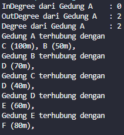

##### Hasil running pada langkah 17

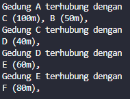


### 2.1.3 Pertanyaan

1. Perbaiki kode program Anda apabila terdapat error atau hasil kompilasi kode tidak sesuai!

    Jawab: Sudah

2. Pada class Graph, terdapat atribut list[] bertipe DoubleLinkedList. Sebutkan tujuan pembuatan variabel tersebut!

    Jawab: tujuan variabel atribut list[] bertipe DoubleLinkedList berfungsi untuk melakukan penyimpanan pada informasi mengenai koneksi antara vertex yang ada dalam grafik

3. Jelaskan alur kerja dari method removeEdge!

    Jawab: alur kerja dari method removeEdge berfungsi untuk menghilangkan edge diantara dua vertex yang ada dalam grafik. dan menerima parameter asal lalu tujuan. lalu method ini akan melakukan perulangan dan menghilangkan edge jika ada kondisi yang sudah terpenuhi.

4. Apakah alasan pemanggilan method addFirst() untuk menambahkan data, bukan method add jenis lain saat digunakan pada method addEdge pada class Graph?

    Jawab: alasan pemanggilan method addFirst() untuk menambahkan data adalah untuk melakukan pemastian apakah edge yang baru dibuat sudah berada pada head atau awal node. Dan Penggunaan addFirst() daripada metode add() lainnya pada LinkedList biasanya dilakukan untuk mempertahankan urutan tetangga yang ada dalam graf.

5. Modifikasi kode program sehingga dapat dilakukan pengecekan apakah terdapat jalur antara

    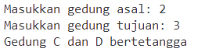
    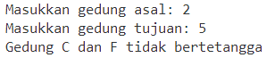

    Jawab:

##### Melakukan penambahan pada method cekEdge()

```java
public void cekEdge(int asal, int tujuan) throws Exception {
    boolean cek = false;
    for(int i = 0; i < list[asal].size(); i++) {
        if(list[asal].get(i) == tujuan) {
            cek = true;
        }
    }
    if(cek == true) {
        System.out.println("Gedung " + (char) ('A' + asal) + " dan " + (char) ('A' + tujuan) + " bertetangga");
    } else {
        System.out.println("Gedung " + (char) ('A' + asal) + " dan " + (char) ('A' + tujuan) + " tidak bertetangga");
    }
}
```

##### Output pada kode program

Output pada cek edge

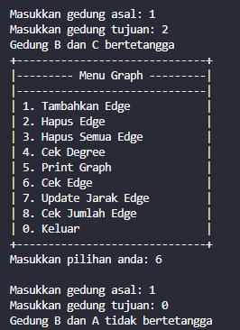


### 2.2 Percobaan 2: Implementasi Graph menggunakan Matriks

Dengan menggunakan kasus yang sama dengan Percobaan 1, pada percobaan ini implementasi graf dilakukan dengan menggunakan matriks dua dimensi.

### 2.2.1 Langkah-langkah Percobaan

Waktu percobaan: 60 menit


##### Class pada kode program

Class pada GraphMatriks

```java
package minggu15.prak2;


public class GraphMatriks07 {
    int vertex;
    int[][] matriks;

    public GraphMatriks07(int v){
        vertex = v;
        matriks = new int[v][v];
    }

    public void makeEdge(int asal, int tujuan, int jarak){
        matriks[asal][tujuan] = jarak;
    }

    public void removeEdge(int asal, int tujuan){
        matriks[asal][tujuan] = 0;
    }

    public void printGraph() {
        for (int i = 0; i < vertex; i++) {
            System.out.print("Gedung " + (char) ('A' + i) + ": ");
            for (int j = 0; j < vertex; j++) {
                if (matriks[i][j] != -1) {
                    System.out.print("Gedung " + (char) ('A' + j) + " (" + matriks[i][j] + " m), ");
                }
            }
            System.out.println();
        }
    }
}
```

##### Main pada kode program

Main pada GraphMatriksMain

```java
package minggu15.prak2;

public class GraphMain07 {
    public static void main(String[] args) {
        GraphMatriks07 gdg = new GraphMatriks07(4);
        gdg.makeEdge(0, 1, 50);
        gdg.makeEdge(1, 0, 60);
        gdg.makeEdge(1, 2, 70);
        gdg.makeEdge(2, 1, 80);
        gdg.makeEdge(2, 3, 40);
        gdg.makeEdge(3, 0, 90);
        gdg.printGraph();
        System.out.println("Hasil setelah penghapusan edge");
        gdg.removeEdge(2, 1);
        gdg.printGraph();
    }
}
```

### 2.2.2 Verifikasi Hasil Percobaan

Verifikasi hasil kompilasi kode program Anda dengan gambar berikut ini.

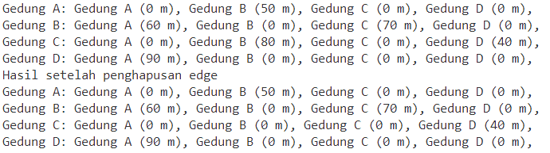

##### Output pada kode program

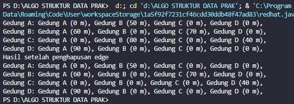


### 2.2.3 Pertanyaan

1. Perbaiki kode program Anda apabila terdapat error atau hasil kompilasi kode tidak sesuai!

    Jawab: Sudah

2. Apa jenis graph yang digunakan pada Percobaan 2?

    Jawab: jenis graph yang digunakan pada Percobaan 2 adalah Graph Matriks

3. Apa maksud dari dua baris kode berikut?

    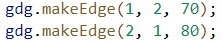

    Jawab:  maksud dari dua baris kode diatas berfungsi untuk membuat edge dari gedung B pada ke gedung C yang memiliki jarak 70 meter lalu gedung C pada gedung B yang memiliki jarak 80 meter

4. Modifikasi kode program sehingga terdapat method untuk menghitung degree, termasuk inDegree dan outDegree!

    Jawab:

    Menggunakan Method Degree

##### Class pada kode program

```java
public void degree(int asal) {
        int totalIn = 0, totalOut = 0;
        for (int i = 0; i < vertex; i++) {
            //indegree
            if (matriks[i][asal] != 0) {
                totalIn++;
            }
            //outdegree
            if (matriks[asal][i] != 0) {
                totalOut++;   
            }
        }
        System.out.println("InDegree dari Gedung " + (char) ('A' + asal) + "    : " + totalIn);
        System.out.println("OutDegree dari Gedung " + (char) ('A' + asal) + "   : " + totalOut);
        System.out.println("Degree dari Gedung " + (char) ('A' + asal) + "      : " + (totalIn + totalOut));
    }
```

##### Main pada kode program

```java
 gdg.degree(0);
```

##### Output pada kode program

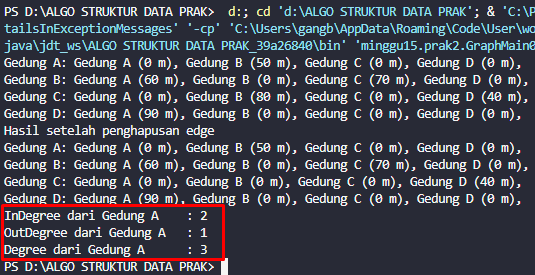


### 3. Latihan Praktikum

Waktu percobaan: 90 menit

1. Modifikasi kode program pada class GraphMain sehingga terdapat menu program yang bersifat dinamis, setidaknya terdiri dari:
a)
Add Edge
b)
Remove Edge
c)
Degree
d)
Print Graph
e)
Cek Edge
Pengguna dapat memilih menu program melalui input Scanner

Jawab: 

##### Class pada kode program

Class pada GraphMain

```java
package minggu15.latprak;

import java.util.Scanner;
public class GraphMain07 {
    public static int menu() {
        Scanner sc = new Scanner(System.in);
        System.out.println("+------------------------------+");
        System.out.println("|--------- Menu Graph ---------|");
        System.out.println("|------------------------------|");
        System.out.println("| 1. Tambahkan Edge            |");
        System.out.println("| 2. Hapus Edge                |");
        System.out.println("| 3. Hapus Semua Edge          |");
        System.out.println("| 4. Cek Degree                |");
        System.out.println("| 5. Print Graph               |");
        System.out.println("| 6. Cek Edge                  |");
        System.out.println("| 7. Update Jarak Edge         |");
        System.out.println("| 8. Cek Jumlah Edge           |");
        System.out.println("| 0. Keluar                    |");
        System.out.println("+------------------------------+");
        System.out.print("Masukkan pilihan anda: ");
        int menu = sc.nextInt();
        return menu;
    }

    public static void main(String[] args) throws Exception {
        Scanner sc = new Scanner(System.in);
        Graph07 gedung = new Graph07(6);
        
        while (true) {
            int pilih = menu();
            System.out.println();
            switch (pilih) {
                case 0:
                System.exit(0);
                break;
                
                case 1:
                    System.out.println("|--------------------|");
                    System.out.println("|  MENAMBAHKAN EDGE  |");
                    System.out.println("|--------------------|\n");
                    System.out.print("Masukkan gedung asal [index dari 0]: ");
                    int asal = sc.nextInt();
                    System.out.print("Masukkan gedung tujuan [index dari 0]: ");
                    int tujuan = sc.nextInt();
                    System.out.print("Masukkan Jarak: ");
                    int jarak = sc.nextInt();
                    gedung.addEdge(asal, tujuan, jarak);
                break;

                case 2:
                    System.out.println("|--------------------|");
                    System.out.println("|   MENGHAPUS EDGE   |");
                    System.out.println("|--------------------|\n");
                    System.out.print("Masukkan gedung asal [index dari 0]: ");
                    int asal1 = sc.nextInt();
                    System.out.print("Masukkan gedung tujuan [index dari 0]: ");
                    int tujuan1 = sc.nextInt();
                    gedung.removeEdge(asal1, tujuan1);
                break;

                case 3:
                    System.out.print("Apakah anda yakin ingin menghapus semua edge? [y/n] : ");
                    char p = sc.next().charAt(0);
                    if (p == 'y') {
                        gedung.removeAllEdge();
                    } else if (p == 'n') {
                        System.out.println("Penghapusan seluruh edge dibatalkan!!");
                    }
                break;
                
                case 4:
                    System.out.println("Masukkan index gedung [index dari 0]: ");
                    int index = sc.nextInt();
                    gedung.degree(index);
                break;

                case 5:
                    gedung.printGraph();
                break;

                case 6:
                    System.out.print("Masukkan gedung asal: ");
                    int asal2 = sc.nextInt();
                    System.out.print("Masukkan gedung tujuan: ");
                    int tujuan2 = sc.nextInt();
                    gedung.cekEdge(asal2, tujuan2);
                break;

                case 7:
                    System.out.print("Masukkan gedung asal: ");
                    int asal3 = sc.nextInt();
                    System.out.print("Masukkan gedung tujuan: ");
                    int tujuan3 = sc.nextInt();
                    System.out.print("Masukkan jarak baru: ");
                    int jarakBaru = sc.nextInt();
                    gedung.updateJarak(asal3, tujuan3, jarakBaru);
                break;

                case 8:
                    gedung.hitungEdge();
                break;
            }
        }
    }
}
```

##### Output pada kode program

a. Output pada Menu Graph

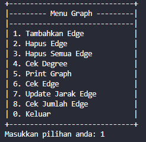

b. Output Penambahan Edge

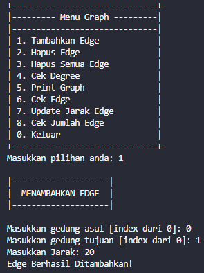

c. Output Cetak Edge

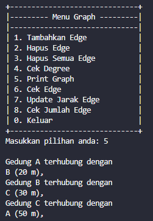

d. Output penghapusan Edge

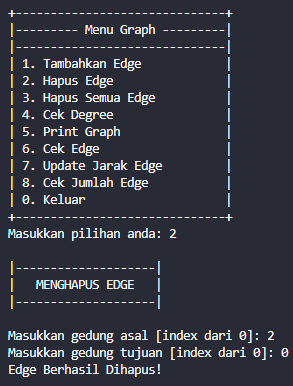


2. Tambahkan method updateJarak pada Percobaan 1 yang digunakan untuk mengubah jarak antara dua node asal dan tujuan!

    Jawab:

##### Melakukan penambahan method updateJarak() pada class Graph07

```java
public void updateJarak(int asal, int tujuan, int jarakBaru) throws Exception {
    boolean cek = false;
    for(int i = 0; i < list[asal].size(); i++) {
        if(list[asal].get(i) == tujuan) {
            cek = true;
        }
    }
    if (cek == true) {
        list[asal].updateJarak(tujuan, jarakBaru);
        System.out.println("Jarak Gedung " + (char) ('A' + asal) + " dan " + (char) ('A' + tujuan) + " diperbarui menjadi " + jarakBaru + " m");
    } else {
        System.out.println("Gedung " + (char) ('A' + asal) + " dan " + (char) ('A' + tujuan) + " tidak bertetangga");
    }
}
```

##### Melakukan penambahan method updateJarak() pada class DoubleLinkedLists07

```java
public void updateJarak(int tujuan, int jarakBaru) throws Exception {
    Node07 current = head;
    boolean cek = false;
    while (current != null) {
        if (current.data == tujuan) {
            current.jarak = jarakBaru;
            cek = true;
            break;
        }
        current = current.next;
    }
    if (!cek) {
        throw new Exception("Tujuan tidak ditemukan dalam daftar");
    }
}
```

##### Melakukan penambahan pada class GraphMain07

```java
System.out.print("Masukkan gedung asal: ");
int asal3 = sc.nextInt();
System.out.print("Masukkan gedung tujuan: ");
int tujuan3 = sc.nextInt();
System.out.print("Masukkan jarak baru: ");
int jarakBaru = sc.nextInt();
gedung.updateJarak(asal3, tujuan3, jarakBaru);
```

##### Output pada kode program

a. Output pada jarak Graph

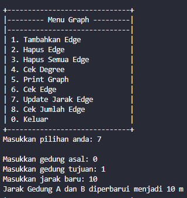
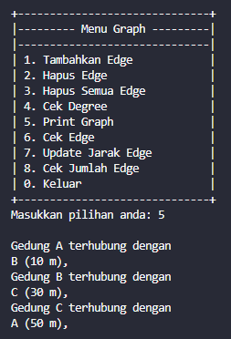

3. Tambahkan method hitungEdge untuk menghitung banyaknya edge yang terdapat di dalam graf!

    Jawab: 

##### Melakukan penambahan method hitungEdge()

```java
public void hitungEdge() {
    int jml = 0;
    for (int i = 0; i < vertex; i++) {
        jml += list[i].size();
    }
    System.out.println("Jumlah Edge dari Graph: " + jml);
}
```

##### Output pada kode program

a. Output pada jumlah edge

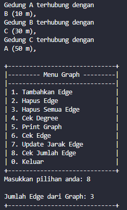


