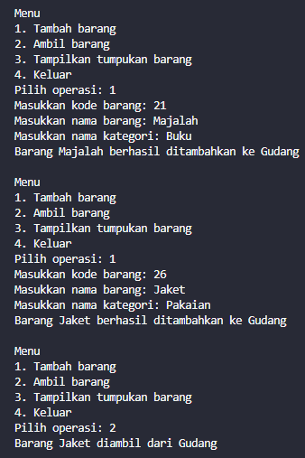
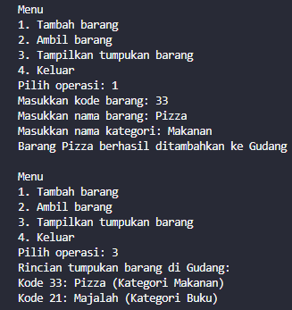
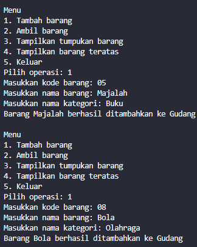
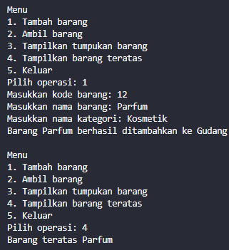
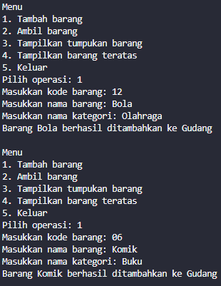
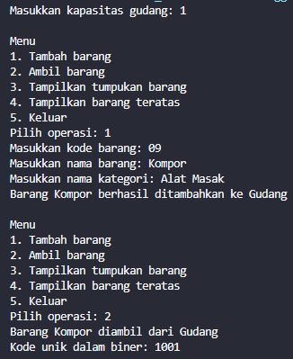
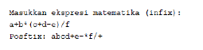
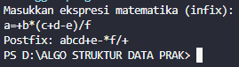
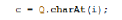

# JOBSHEET VI SEARCHING

Nama    : Cakra Wangsa M.A.W

Kelas   : TI_1H

Absen   : 07

NIM     : 2341720032

### 1. Tujuan Praktikum

Setelah melakukan materi praktikum ini, mahasiswa mampu:

1. Membuat struktur data Stack
2. Menerapkan algoritma Stack ke dalam program

### 2. Praktikum

### 2.1 Percobaan 1: Penyimpanan Tumpukan Barang dalam Gudang

Class pada kode program

```java
package minggu8.program;
public class Barang07 {
    int kode;
    String nama;
    String kategori;

    Barang07(int kode, String nama, String kategori) {
        this.kode = kode;
        this.nama = nama;
        this.kategori = kategori;
    }
}
```

Main pada kode program

```java
package minggu8.program;

public class Gudang07 {
    Barang07[] tumpukan;
    int size;
    int top;

    public Gudang07(int kapasitas) {
        size = kapasitas;
        tumpukan = new Barang07[size];
        top = -1;
    }

    public boolean cekKosong() {
        if (top == -1) {
            return true;
        } else {
            return false;
        }
    }

    public boolean cekPenuh() {
        if (top == size - 1) {
            return true;
        } else {
            return false;
        }
    }

    public void tambahBarang(Barang07 brg) {
        if (!cekPenuh()) {
            top++;
            tumpukan[top] = brg;
            System.out.println("Barang " + brg.nama + " berhasil ditambahkan ke Gudang");
        } else {
            System.out.println("Gagal! Tumpukan barang di Gudang sudah penuh");
        }
    }

    public Barang07 ambilBarang() {
        if (!cekKosong()) {
            Barang07 delete = tumpukan[top];
            top--;
            System.out.println("Barang " + delete.nama + " diambil dari Gudang");
            return delete;
        } else {
            System.out.println("Gagal! Tumpukan barang di Gudang masih kosong");
            return null;
        }
    }

    public Barang07 lihatBarangTeratas() {
        if (!cekKosong()) {
            Barang07 barangTeratas = tumpukan[top];
            System.out.println("Barang teratas " + barangTeratas.nama);
            return barangTeratas;
        } else {
            System.out.println("Tumpukan barang kosong");
            return null;
        }
    }

    public void tampilkanBarang() {
        if (!cekKosong()) {
            System.out.println("Rincian tumpukan barang di Gudang:");
            for (int i = top; i >= 0; i--) {
                System.out.printf("Kode %d: %s (Kategori %s)\n", tumpukan[i].kode, tumpukan[i].nama,
                        tumpukan[i].kategori);
            }
        } else {
            System.out.println("Tumpukan barang kosong");
        }
    }
}
```

```java
package minggu8.program;

import java.util.Scanner;

public class Utama07 {
    public static void main(String[] args) {
        Gudang07 gudang = new Gudang07(7);
        Scanner scanner = new Scanner(System.in);

        while (true) {
            System.out.println("\nMenu");
            System.out.println("1. Tambah barang");
            System.out.println("2. Ambil barang");
            System.out.println("3. Tampilkan tumpukan barang");
            System.out.println("4. Keluar");
            System.out.print("Pilih operasi: ");
            int pilihan = scanner.nextInt();
            scanner.nextLine();

            switch (pilihan) {
                case 1:
                    System.out.print("Masukkan kode barang: ");
                    int kode = scanner.nextInt();
                    scanner.nextLine();
                    System.out.print("Masukkan nama barang: ");
                    String nama = scanner.nextLine();
                    System.out.print("Masukkan nama kategori: ");
                    String kategori = scanner.nextLine();
                    Barang07 barangBaru = new Barang07(kode, nama, kategori);
                    gudang.tambahBarang(barangBaru);
                    break;

                case 2:
                    gudang.ambilBarang();
                    break;

                case 3:
                    gudang.tampilkanBarang();
                    break;

                case 4:
                    // exit program
                    return;

                default:
                    System.out.println("Pilihan tidak valid. Silahkan coba lagi");
            }
        }
    }
}
```

### 2.1.2 Verifikasi Hasil Percobaan

Output pada kode program




### 2.1.3 Pertanyaan

1. Lakukan perbaikan pada kode program, sehingga keluaran yang dihasilkan sama dengan verifikasi hasil percobaan! Bagian mana saja yang perlu diperbaiki?

Jawab: Yang perlu diperbaiki pada kode program adalah pada method tampilkanBarang, dan terdapat pada looping yang awalnya `int i = 0;`diganti menjadi `int i = top;` sehingga keluaran urutan barang sesuai

```java
public void tampilkanBarang() {
        if (!cekKosong()) {
            System.out.println("Rincian tumpukan barang di Gudang:");
            for (int i = top; i >= 0; i--) {
                System.out.printf("Kode %d: %s (Kategori %s)\n", tumpukan[i].kode, tumpukan[i].nama,
                        tumpukan[i].kategori);
            }
        } else {
            System.out.println("Tumpukan barang kosong");
        }
    }
```

2. Berapa banyak data barang yang dapat ditampung di dalam tumpukan? Tunjukkan potongan kode programnya!

Jawab: data barang yang dapat ditampung dalam tumpukan adalah 7 data barang

```java
Gudang07 gudang = new Gudang07(7);
```

3. Mengapa perlu pengecekan kondisi !cekKosong() pada method tampilkanBarang? Kalau kondisi tersebut dihapus, apa dampaknya?

Jawab: perlu pengecekan kondisi dikarenakan untuk bisa melihat apakah disitu terdapat tumpukan kosong atau tidak sebelum ditampilkan barang yang berada pada tumpukan. Jika kondisi tersebut dihapus maka akan berdampak pada kode program yang tidak akan melakukan pengecekan mengenai ada atau tidaknya barang pada tumpukan kosong.

```java
    public void tampilkanBarang() {
        System.out.println("Rincian tumpukan barang di Gudang:");
        for (int i = top; i >= 0; i--) {
            System.out.printf("Kode %d: %s (Kategori %s)\n", tumpukan[i].kode, tumpukan[i].nama,
                    tumpukan[i].kategori);
        }
    }
```

4. Modifikasi kode program pada class Utama sehingga pengguna juga dapat memilih operasi lihat barang teratas, serta dapat secara bebas menentukan kapasitas gudang!

Jawab: 

Code program

```java
package minggu8.program;

import java.util.Scanner;

public class Utama07 {
    
    public static void main(String[] args) {
        Scanner scanner = new Scanner(System.in);

        System.out.print("Masukkan kapasitas gudang: ");
        int kapasitas = scanner.nextInt();
        scanner.nextLine();

        Gudang07 gudang = new Gudang07(kapasitas);

        while (true) {
            System.out.println("\nMenu");
            System.out.println("1. Tambah barang");
            System.out.println("2. Ambil barang");
            System.out.println("3. Tampilkan tumpukan barang");
            System.out.println("4. Tampilkan barang teratas");
            System.out.println("5. Keluar");
            System.out.print("Pilih operasi: ");
            int pilihan = scanner.nextInt();
            scanner.nextLine();

            switch (pilihan) {
                case 1:
                    System.out.print("Masukkan kode barang: ");
                    int kode = scanner.nextInt();
                    scanner.nextLine();
                    System.out.print("Masukkan nama barang: ");
                    String nama = scanner.nextLine();
                    System.out.print("Masukkan nama kategori: ");
                    String kategori = scanner.nextLine();
                    Barang07 barangBaru = new Barang07(kode, nama, kategori);
                    gudang.tambahBarang(barangBaru);
                    break;

                case 2:
                    gudang.ambilBarang();
                    break;

                case 3:
                    gudang.tampilkanBarang();
                    break;

                case 4:
                    gudang.lihatBarangTeratas();
                    break;

                case 5:
                    // exit program
                    break;

                default:
                    System.out.println("Pilihan tidak valid. Silahkan coba lagi");
            }
        }
    }

}
```

Output pada kode program




5. Commit dan push kode program ke Github

Jawab:


### 2.2 Percobaan 2: Konversi Kode Barang ke Biner

Class pada kode program

```java
package minggu8.program;

public class StackKonversi07 {
    
    int size;
    int[] tumpukanBiner;
    int top;

    public StackKonversi07() {
        this.size = 32; // asumsi 32bit
        this.tumpukanBiner = new int[size];
        this.top = -1;
    }

    public boolean isEmpty() {
        return top == -1;
    }

    public boolean isFull() {
        return top == size - 1;
    }

    public void push(int data) {
        if (isFull()) {
            System.out.println("Stack penuh");
        } else {
            top++;
            tumpukanBiner[top] = data;
        }
    }

    public int pop() {
        if (isEmpty()) {
            System.out.println("Stack kosong");
            return -1;
        } else {
            int data = tumpukanBiner[top];
            top--;
            return data;
        }
    }

}
```

Main pada kode program

```java
package minggu8.program;

public class Gudang07 {
    
    Barang07[] tumpukan;
    int size;
    int top;

    public Gudang07(int kapasitas) {
        size = kapasitas;
        tumpukan = new Barang07[size];
        top = -1;
    }

    public boolean cekKosong() {
        if (top == -1) {
            return true;
        } else {
            return false;
        }
    }

    public boolean cekPenuh() {
        if (top == size - 1) {
            return true;
        } else {
            return false;
        }
    }

    public void tambahBarang(Barang07 brg) {
        if (!cekPenuh()) {
            top++;
            tumpukan[top] = brg;
            System.out.println("Barang " + brg.nama + " berhasil ditambahkan ke Gudang");
        } else {
            System.out.println("Gagal! Tumpukan barang di Gudang sudah penuh");
        }
    }

    public Barang07 ambilBarang() {
        if (!cekKosong()) {
            Barang07 delete = tumpukan[top];
            top--;
            System.out.println("Barang " + delete.nama + " diambil dari Gudang");
            System.out.println("Kode unik dalam biner: " + konversiDesimalkeBiner(delete.kode));
            return delete;
        } else {
            System.out.println("Gagal! Tumpukan barang di Gudang masih kosong");
            return null;
        }
    }

    public Barang07 lihatBarangTeratas() {
        if (!cekKosong()) {
            Barang07 barangTeratas = tumpukan[top];
            System.out.println("Barang teratas " + barangTeratas.nama);
            return barangTeratas;
        } else {
            System.out.println("Tumpukan barang kosong");
            return null;
        }
    }

    public void tampilkanBarang() {
        if (!cekKosong()) {
            System.out.println("Rincian tumpukan barang di Gudang:");
            for (int i = top; i >= 0; i--) {
                System.out.printf("Kode %d: %s (Kategori %s)\n", tumpukan[i].kode, tumpukan[i].nama,
                        tumpukan[i].kategori);
            }
        } else {
            System.out.println("Tumpukan barang kosong");
        }
    }

    public String konversiDesimalkeBiner(int kode) {
        StackKonversi07 stack = new StackKonversi07();
        while (kode > 0) {
            int sisa = kode % 2;
            stack.push(sisa);
            kode = kode / 2;
        }
        String biner = new String();
        while (!stack.isEmpty()) {
            biner += stack.pop();
        }
        return biner;
    }

}
```

### 2.2.2 Verifikasi Hasil Percobaan

Output pada kode program




### 2.2.3 Pertanyaan

1. Pada method konversiDesimalKeBiner, ubah kondisi perulangan menjadi while (kode != 0), bagaimana hasilnya? Jelaskan alasannya!

Jawab: Hasilnya sama saja dikarenakan pada kedua kode while hanya berguna untuk memastikan pada proses konversi berlanjut ketika masih ada angka desimal yang belum dikonversi.

```java
public String konversiDesimalkeBiner(int kode) {
        StackKonversi07 stack = new StackKonversi07();
        while (kode != 0) {
            int sisa = kode % 2;
            stack.push(sisa);
            kode = kode / 2;
        }
        String biner = new String();
        while (!stack.isEmpty()) {
            biner += stack.pop();
        }
        return biner;
    }
```

Output pada kode program



2. Jelaskan alur kerja dari method konversiDesimalKeBiner!

Jawab: Metode pertama akan membuat objek "StackKonversi07" yang akan digunakan untuk menyimpan sisa pembagian. Kemudian kode melakukan iterasi selama kode!= 0. pada setiap iterasi, kode menghitung sisa pembagian dari kode dibagi 2 dan akan memasukkannya ke dalam stack, yang akan mengubah nilai "kode" menjadi hasil pembagian "kode"/2. Setelah iterasi selesai, kode membaca sisa-sisa yang telah dimasukkan ke dalam stack untuk membentuk bilangan

### 2.3 Percobaan 3: Konversi Notasi Infix ke Postfix

Class pada kode program 

```java
package minggu8.program;

public class PostFix07 {
    
    int n, top;
    char[] stack;

    public PostFix07(int total) {
        n = total;
        top = -1;
        stack = new char[n];
        push('(');
    }

    public void push(char data) {
        top++;
        stack[top] = data;
    }

    public char pop() {
        char item = stack[top];
        top--;
        return item;
    }

    public boolean IsOperand(char c) {
        if ((c >= 'A' && c <= 'Z') || (c >= 'a' && c <= 'z') || (c >= '0' && c <= '9') || c == ' ' || c == '.') {
            return true;
        } else {
            return false;
        }
    }

    public boolean IsOperator(char c) {
        if (c == '^' || c == '%' || c == '/' || c == '*' || c == '-' || c == '+') {
            return true;
        } else {
            return false;
        }
    }

    public int derajat(char c) {
        switch (c) {
            case '^':
                return 3;
            case '%':
                return 2;
            case '/':
                return 2;
            case '*':
                return 2;
            case '+':
                return 1;
            case '-':
                return 1;
            default:
                return 0;
        }
    }

    public String konversi(String Q) {
        String P = "";
        char c;
        for (int i = 0; i < Q.length(); i++) {
            c = Q.charAt(i);
            if (IsOperand(c)) {
                P = P + c;
            }
            if (c == '(') {
                push(c);
            }
            if (c == ')') {
                while (stack[top] != '(') {
                    P = P + pop();
                }
                pop();
            }
            if (IsOperator(c)) {
                while (derajat(stack[top]) >= derajat(c)) {
                    P = P + pop();
                }
                push(c);
            }
        }
        return P;
    }


}
```

Main pada kode program

```java
package minggu8.program;

import java.util.Scanner;
public class PostFixmain07 {
    
    public static void main(String[] args) {
        Scanner sc = new Scanner(System.in);
        String P, Q;

        System.out.println("Masukkan ekspresi matematika (infix): ");
        Q = sc.nextLine();
        Q = Q.trim();
        Q = Q + ")";

        int total = Q.length();
        PostFix07 post = new PostFix07(total);
        P = post.konversi(Q);
        System.out.println("Postfix: " + P);
    }
}
```

### 2.3.2 Verifikasi Hasil Percobaan
Cocokkan hasil compile kode program Anda dengan gambar berikut ini.





Output pada kode program

### 2.3.3 Pertanyaan

1. Pada method derajat, mengapa return value beberapa case bernilai sama? Apabila return value diubah dengan nilai berbeda-beda setiap case-nya, apa yang terjadi?

Jawab: Dalam kasus tertentu, seperti ketika operator %, /, dan _ mengembalikan nilai 2, menunjukkan bahwa operator tersebut memiliki prioritas yang setara dalam ekspresi matematika, yang dapat diartikan bahwa operator %, /, dan _ memiliki prioritas yang sama, tetapi di bawah operator ^, yang memiliki prioritas yang lebih tinggi, yang mengembalikan nilai 4.

2. Jelaskan alur kerja method konversi!

Jawab: Hasil konversi dari ekspresi infix ke postfix pertama-tama disimpan melalui string kosong P. Setiap karakter dalam string Q kemudian diiterasi. Jika karakter tersebut adalah operand, maka karakter tersebut dimasukkan ke string P. Jika karakter tersebut adalah "(", maka tanda kurung tersebut dimasukkan ke dalam stack. Jika karakter tersebut adalah "(", maka tanda kurung tersebut dimasukkan ke dalam stack. Jika karakter tersebut adalah "(", maka dilakukan pengosongan stack sampai menemukan "(". Setiap karakter yang dikeluarkan dari stack dimasukkan ke dalam string P. Jika karakter tersebut adalah operator, Operator saat ini dimasukkan ke dalam stack setelah itu. Hasil konversi disimpan setelah iterasi selesai. dan hasil konversi dikembalikan

3. Pada method konversi, apa fungsi dari potongan kode berikut?


Jawab: Kode tersebut akan mengambil karakter dari string "Q" pada indeks ke i dan akan disimpan pada variabel "c". yang berguna untuk melakukan proses pada setiap karakter secara urut dalam string "Q" saat iterasi dilakukan dalam loop for. Dengan cara ini, kode dapat memeriksa dan mengatur setiap karakter secara terpisah untuk konversi ekspresi infix ke postfix.

### 2.4 Latihan Praktikum

Waktu : 60 Menit

Perhatikan dan gunakan kembali kode program pada Percobaan
 
1. Tambahkan dua method berikut pada class Gudang:

• Method lihatBarangTerbawah digunakan untuk mengecek barang pada tumpukan terbawah

• Method cariBarang digunakan untuk mencari ada atau tidaknya barang berdasarkan kode barangnya atau nama barangnya


